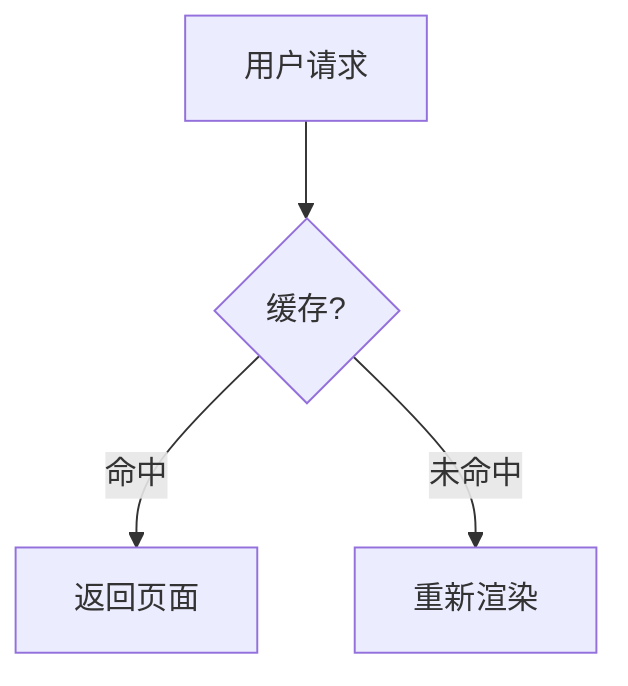

# Gemini 的博客

基于 Next.js 16 + React 19 + Tailwind CSS 4 的个人技术博客，支持 MDX 写作、代码高亮、Mermaid 图表。

## 快速开始

```bash
# 安装依赖
pnpm install

# 启动开发服务器
pnpm dev

# 构建生产版本
pnpm build
```

## 写文章

### 快速创建

```bash
pnpm create-mdx
```

交互式流程：
1. 选择分类目录
2. 输入文章标题（中文自动转拼音 slug）
3. 勾选已有标签 + 输入新标签
4. 选择封面图（自动扫描 `public/` 目录）
5. 输入文章摘要
6. 是否设为精选

一步生成完整的 `.mdx` 文件。

### VS Code 代码片段

在 `.mdx` 文件中输入以下缩写即可快速插入组件：

| 缩写 | 功能 |
|------|------|
| `fm` | Frontmatter 模板 |
| `code` | 代码块 |
| `mermaid` | Mermaid 图表 |
| `img` | 可点击放大图片 |
| `tip` | 提示框（info/success/warning/error）|
| `card` | 卡片组件 |
| `latex` | 行内公式 |
| `latexb` | 块级公式 |
| `table` | 表格 |
| `author` | 作者信息

每篇文章顶部需要 YAML frontmatter：

```yaml
---
title: 文章标题
date: 2025-12-15
author: Gemini
tags: ["React", "前端"]
description: 文章摘要
cover: /path/to/cover.jpg   # 可选头图
isFeatured: false            # 是否设为精选文章
---
```

### MDX 功能

**代码高亮** — 使用标准 Markdown 围栏语法，服务端渲染，支持所有常用语言：

````mdx
```typescript
interface User {
  name: string;
  age: number;
}
```

```python
def greet(name: str) -> str:
    return f"Hello, {name}"
```
````

**Mermaid 图表** — 用 `mermaid` 语言标记，支持流程图、时序图等：

````mdx

````

**LaTeX 数学公式** — 用 KaTeX 渲染，支持行内和块级公式：

```mdx
行内公式：$E = mc^2$

块级公式：
$$
\int_{-\infty}^{\infty} e^{-x^2} dx = \sqrt{\pi}
$$

矩阵：
$$
\begin{bmatrix}
a & b \\
c & d
\end{bmatrix}
$$
```

**图片** — 使用 `Image` 组件，点击可放大预览：

```mdx
<Image src="/docker/1.png" alt="截图" width={800} height={400} />
```

图片放在 `public/` 目录下，引用时路径以 `/` 开头。

**提示框** — 四种类型：info / success / warning / error：

```mdx
<Tip type="info">这是一条信息提示。</Tip>
<Tip type="warning">这是一条警告。</Tip>
```

**卡片组件**：

```mdx
<Card>
  <CardHeader>
    <CardTitle>标题</CardTitle>
    <CardDescription>描述</CardDescription>
  </CardHeader>
  <CardContent>内容</CardContent>
</Card>
```

### 添加新分类

1. 在 `src/content/` 下新建文件夹
2. 在 `src/config/catalogs.ts` 中添加显示名和图标

```ts
export const catalogMeta = {
  // ...
  python: { label: 'Python', icon: devicon('python') },
};
```

侧边栏会自动显示所有有内容的分类。

## 项目结构

```
src/
├── app/                  # Next.js App Router 页面
│   ├── [catalog]/        # 分类页 + 文章页
│   ├── tags/             # 标签页
│   ├── api/search/       # 搜索 API
│   ├── rss.xml/          # RSS 订阅
│   ├── sitemap.ts        # 站点地图
│   └── robots.ts         # Robots.txt
├── components/
│   ├── layout/           # Header、Sidebar
│   ├── home/             # HeroSection、PostCard、FeaturedPost
│   ├── mdx/              # MDX 自定义组件（Image、Mermaid、Tip）
│   ├── article/          # TableOfContents、AuthorBio
│   └── ui/               # shadcn/ui 组件
├── config/
│   ├── site.ts           # 站点基本信息
│   └── catalogs.ts       # 分类元数据
├── content/              # MDX 文章（按分类分文件夹）
├── lib/                  # 工具函数
└── types/                # TypeScript 类型
```

## 部署

项目配置了 GitHub Actions 自动部署到 Vercel，推送 `main` 分支即可触发。

需要在 GitHub Secrets 中配置：
- `VERCEL_TOKEN`
- `VERCEL_ORG_ID`
- `VERCEL_PROJECT_ID`
