# Java入门

## 什么是Java
JavaSE: Java Standard Edition, Java技术核心和基础, 标准版。
JavaEE: Java Enterprise Edition, Java企业级开发方案, 企业版。
JavaME: Java Micro Editon, Java移动端设备应用开发方案, 小型版。

## 如何开发Java程序
- 编写 `.java` 源码
- 命令行 `javac` 编译生成 `.class` 字节码文件
- 运行 `java` 命令启动 JVM 执行

### 一次编译，到处运行

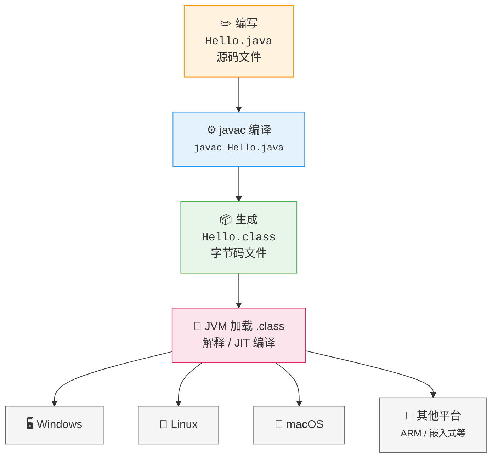
## 字面量
数字字面量：1，2，3，4
字符串字面量：“xxxx”

## 变量

变量就像是贴了标签的盒子，用来存放数据。语法：`数据类型 变量名称 = 数据`

```java
int age = 25;        // 定义一个整型变量 age，赋值为 25
double price = 9.99; // 定义一个浮点型变量 price
String name = "小明"; // 定义一个字符串变量 name
```

盒子的特点是里面的东西可以随时更换：

```java
int count = 10;   // 盒子里放着 10
count = 20;       // 换成 20 了
count = 30;       // 又换成了 30
```

### 变量的核心规则

| 规则 | 说明 | 示例 |
|------|------|------|
| **先声明后使用** | 使用前必须定义类型和名称 | `int x;` → `x = 10;` |
| **同一作用域不可重名** | 一个变量名在同一代码块内只能声明一次 | `int a;` 再写 `int a;` 会报错 |
| **类型固定** | 变量类型一旦确定，只能存放该类型的数据 | `int n = 10;` → `n = "hello";` ❌ |
| **可重新赋值** | 变量内的数据可以多次改变 | `n = 20; n = 30;` ✅ |

## 数据的存储原理

计算机底层只能识别 **0 和 1**，所有数据最终都要转换成二进制才能存储和处理。

### 二进制

我们日常用的是**十进制**（0~9，逢十进一），计算机用的是**二进制**（0 和 1，逢二进一）。

| 十进制 | 二进制 |
|--------|--------|
| 0 | 0 |
| 1 | 1 |
| 2 | 10 |
| 3 | 11 |
| 4 | 100 |
| 5 | 101 |
| 6 | 110 |
| 7 | 111 |
| 8 | 1000 |
| 9 | 1001 |
| 10 | 1010 |

### 字节（Byte）与位（bit）

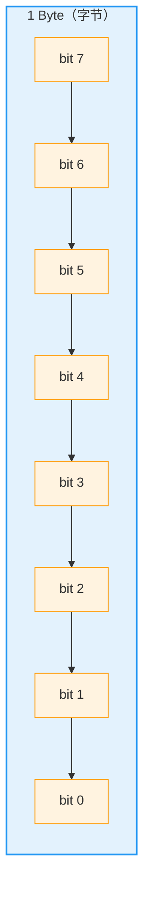

**位 (bit)** —— 计算机中最小的存储单元，只能存 0 或 1
**字节 (Byte)** —— 计算机中最基本的存储单位，1 Byte = 8 bit

1 Byte 能表示 $2^8 = 256$ 种不同的值（00000000 ~ 11111111）

### 常见数据类型占用的字节数

| 数据类型 | 占用字节 | 取值范围 |
|----------|----------|----------|
| `byte` | 1 | -128 ~ 127 |
| `short` | 2 | -32768 ~ 32767 |
| `int` | 4 | -21亿 ~ 21亿 |
| `long` | 8 | 非常大 |
| `float` | 4 | 单精度小数 |
| `double` | 8 | 双精度小数 |
| `char` | 2 | 0 ~ 65535（Unicode 字符）|
| `boolean` | 1 | true / false |

### 字符数据与编码

计算机存字符时，实际上存的是字符对应的**编号**。

#### ASCII 码（美国信息交换标准代码）

最基础的字符编码表，用 **1 个字节**（实际只用后 7 位）表示 128 个字符：

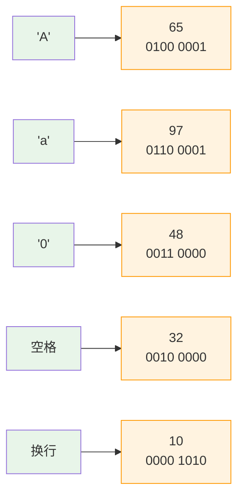

| 字符 | ASCII 码（十进制） | 二进制 |
|------|-------------------|--------|
| `'A'` | 65 | 0100 0001 |
| `'B'` | 66 | 0100 0010 |
| `'a'` | 97 | 0110 0001 |
| `'0'` | 48 | 0011 0000 |
| `' '`（空格） | 32 | 0010 0000 |
| `'!'` | 33 | 0010 0001 |

> ASCII 只能表示英文字母、数字和符号。中文等其他文字需要更大的编码表（如 Unicode/UTF-8）。

### 在 Java 中验证

```java
public class DataDemo {
    public static void main(String[] args) {
        // 字符本质上是数字
        char ch = 'A';
        System.out.println((int) ch); // 输出 65

        // 整数可以赋值给字符
        ch = 66;
        System.out.println(ch); // 输出 B

        // 查看字节大小
        System.out.println(Byte.BYTES);   // 1
        System.out.println(Integer.BYTES); // 4
    }
}
```

## Java中的数据类型

Java 的数据类型分为两大类：**基本数据类型**（Primitive Type）和 **引用数据类型**（Reference Type）。

### 类型体系总览

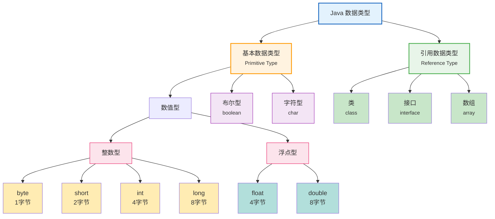

### 基本数据类型（Primitive Type）

基本数据类型是 Java 语言内置的、不可再分的数据类型，存储在**栈内存**中，直接存"值"。

#### 整数类型

```java
byte  a = 100;      // 1字节，范围：-128 ~ 127
short b = 30000;    // 2字节，范围：-32768 ~ 32767
int   c = 2000000;  // 4字节，最常用的整数类型
long  d = 100L;     // 8字节，赋值时建议加 L 后缀
```

| 类型 | 字节 | 范围 | 默认值 |
|------|------|------|--------|
| `byte` | 1 | -128 ~ 127 | 0 |
| `short` | 2 | -32,768 ~ 32,767 | 0 |
| `int` | 4 | -2^31 ~ 2^31-1（约 ±21亿） | 0 |
| `long` | 8 | -2^63 ~ 2^63-1 | 0L |

#### 浮点类型

```java
float  pi = 3.14F;      // 4字节，赋值时加 F 后缀
double e  = 2.71828;    // 8字节，默认小数类型
```

| 类型 | 字节 | 精度 | 默认值 |
|------|------|------|--------|
| `float` | 4 | 约 7 位有效数字 | 0.0f |
| `double` | 8 | 约 15 位有效数字 | 0.0d |

> 精确计算（如金额）不要用 `float` / `double`，要用 `BigDecimal`。

#### 字符类型

```java
char c1 = 'A';       // 单个字符，用单引号
char c2 = 65;        // 可以直接赋整数，等价于 'A'
char c3 = 'A';  // Unicode 表示法，也是 'A'
```

| 类型 | 字节 | 范围 | 默认值 |
|------|------|------|--------|
| `char` | 2 | 0 ~ 65,535（Unicode）| '' |

#### 布尔类型

```java
boolean isJavaFun = true;   // 只能取 true 或 false
boolean isBig      = false;
```

| 类型 | 取值 | 默认值 |
|------|------|--------|
| `boolean` | true / false | false |

### 引用数据类型（Reference Type）

引用数据类型指向内存中的**对象**，变量存的是对象的**地址（引用）**，对象本身在**堆内存**中。

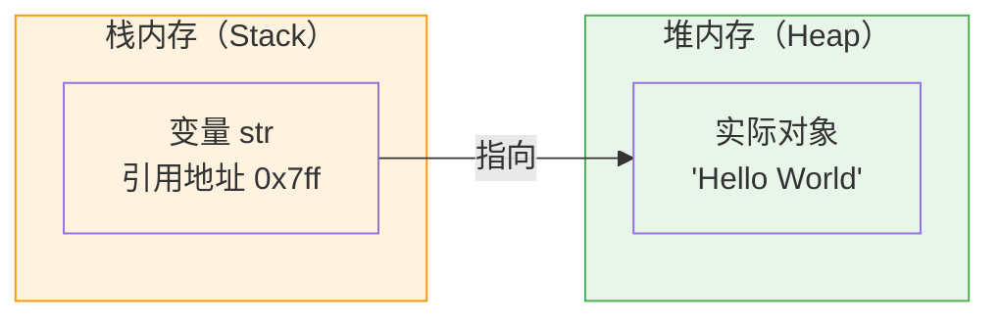

常见引用类型：

```java
String name = "Hello";       // 字符串（最常用的引用类型）
int[] numbers = {1, 2, 3};  // 数组
Scanner sc = new Scanner(System.in); // 自定义对象
```

### 基本类型 vs 引用类型

| 对比维度 | 基本类型 | 引用类型 |
|----------|----------|----------|
| **存储位置** | 栈内存（存值） | 堆内存（存对象），栈存引用地址 |
| **默认值** | 有默认值（如 0, false） | `null` |
| **赋值行为** | 值拷贝 | 引用拷贝（两个变量指向同一对象） |
| **比较** | `==` 比较值 | `==` 比较地址，内容用 `equals()` |

### 类型转换

#### 自动类型转换（隐式转换）

小范围类型自动转换为大范围类型：

```
byte → short → int → long → float → double
                  ↑
                 char
```

```java
int a = 100;
long b = a;        // int → long，自动转换
double c = b;      // long → double，自动转换
```

#### 强制类型转换（显式转换）

大范围类型转小范围需要强制转换，可能丢失精度：

```java
double pi = 3.14159;
int n = (int) pi;         // 强制转换，n = 3（精度丢失）
System.out.println(n);    // 输出 3

// 大数强制转换会有溢出风险
int big = 300;
byte small = (byte) big;  // 300 超过 byte 范围，结果变成 44
```

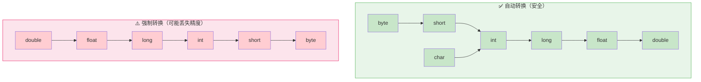

## 数组

数组是**相同数据类型**的元素按一定顺序排列的集合，在内存中是一段**连续的空间**。

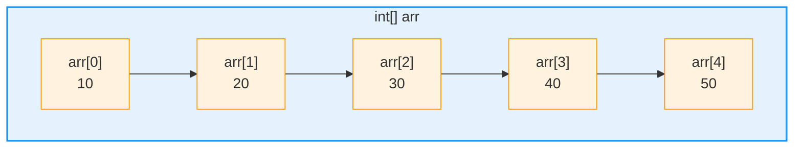

数组的特点：
- **下标从 0 开始**，长度为 n 的数组，下标范围是 0 ~ n-1
- 数组是**引用类型**，存储在堆内存中
- 数组一旦创建，**长度不可变**
- 通过 `数组名.length` 获取数组长度

### 一维数组

#### 动态初始化（先声明长度，再赋值）

```java
// 语法：数据类型[] 数组名 = new 数据类型[长度];

int[] arr = new int[3];   // 创建一个长度为 3 的 int 数组
arr[0] = 10;              // 逐个赋值
arr[1] = 20;
arr[2] = 30;

System.out.println(arr[0]);  // 10
System.out.println(arr[1]);  // 20
System.out.println(arr[2]);  // 30
System.out.println(arr.length);  // 3
```

动态初始化时，数组元素会有**默认值**：

| 数组类型 | 默认值 |
|----------|--------|
| `int[]`、`short[]`、`byte[]`、`long[]` | 0 |
| `float[]`、`double[]` | 0.0 |
| `boolean[]` | false |
| `char[]` | '' |
| 引用类型数组（如 `String[]`） | null |

```java
int[] scores = new int[5];   // 全部默认为 0
scores[0] = 85;              // 修改第一个元素
scores[2] = 92;              // 修改第三个元素
// 未赋值的元素仍然是 0
```

#### 静态初始化（创建时直接指定元素）

```java
// 语法：数据类型[] 数组名 = {元素1, 元素2, ...};

int[] arr = {10, 20, 30, 40, 50};

// 或者写全：
int[] arr2 = new int[]{10, 20, 30, 40, 50};

System.out.println(arr[0]);  // 10
System.out.println(arr[4]);  // 50
System.out.println(arr.length);  // 5
```

#### 遍历数组

```java
int[] arr = {10, 20, 30, 40, 50};

// for 循环遍历（下标方式）
for (int i = 0; i < arr.length; i++) {
    System.out.println("arr[" + i + "] = " + arr[i]);
}

// 增强 for 循环（foreach，无需下标）
for (int num : arr) {
    System.out.println(num);
}
```

#### 数组在内存中的存储

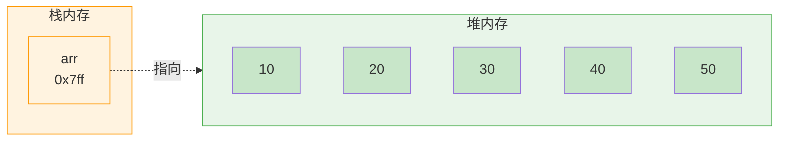

### 二维数组

二维数组本质上是**数组的数组**，可以理解为一张表格：行和列。

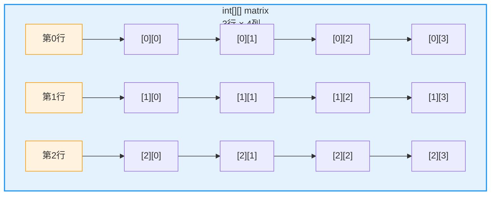

#### 动态初始化

```java
// 语法：数据类型[][] 数组名 = new 数据类型[行数][列数];

int[][] matrix = new int[3][4];  // 3行4列

matrix[0][0] = 1;   // 第0行第0列
matrix[0][1] = 2;
matrix[1][0] = 3;
matrix[2][3] = 12;

System.out.println(matrix[0][0]);  // 1
System.out.println(matrix[2][3]);  // 12
System.out.println(matrix.length);    // 3（行数）
System.out.println(matrix[0].length); // 4（每行的列数）
```

#### 静态初始化

```java
// 语法：数据类型[][] 数组名 = {{...}, {...}, ...};

int[][] matrix = {
    {1, 2, 3, 4},
    {5, 6, 7, 8},
    {9, 10, 11, 12}
};

System.out.println(matrix[1][2]);  // 7
```

#### 遍历二维数组

```java
int[][] matrix = {
    {1, 2, 3, 4},
    {5, 6, 7, 8},
    {9, 10, 11, 12}
};

// 双层 for 循环遍历
for (int i = 0; i < matrix.length; i++) {          // 遍历行
    for (int j = 0; j < matrix[i].length; j++) {   // 遍历列
        System.out.print(matrix[i][j] + " ");
    }
    System.out.println();  // 换行
}
// 输出：
// 1 2 3 4
// 5 6 7 8
// 9 10 11 12
```

### 数组常见操作

```java
public class ArrayDemo {
    public static void main(String[] args) {
        // 求最大值
        int[] scores = {72, 88, 95, 63, 81};
        int max = scores[0];
        for (int i = 1; i < scores.length; i++) {
            if (scores[i] > max) max = scores[i];
        }
        System.out.println("最高分：" + max);  // 95

        // 求和 / 平均值
        int sum = 0;
        for (int score : scores) {
            sum += score;
        }
        double avg = (double) sum / scores.length;
        System.out.println("平均分：" + avg);  // 79.8

        // 反转数组
        int[] nums = {1, 2, 3, 4, 5};
        for (int i = 0, j = nums.length - 1; i < j; i++, j--) {
            int temp = nums[i];
            nums[i] = nums[j];
            nums[j] = temp;
        }
        // nums = {5, 4, 3, 2, 1}
    }
}
```

### 数组的常见问题

```java
int[] arr = new int[3];
arr[0] = 10;
arr[1] = 20;
arr[2] = 30;

// arr[3] = 40;  // ⚠️ 越界！ArrayIndexOutOfBoundsException
// arr = null;
// System.out.println(arr.length);  // ⚠️ 空指针！NullPointerException
```

| 问题 | 说明 | 避免方法 |
|------|------|----------|
| **数组越界** | 访问了不存在的下标（`arr[负数]` 或 `arr[>=length]`） | 确保下标在 `0 ~ length-1` 之间 |
| **空指针异常** | 数组变量为 `null` 时访问其元素或 `length` | 使用前判断 `if (arr != null)` |

## 面向对象

### 对象与类

**对象** —— 现实中具体存在的事物，有属性（特征）和行为（功能）。
**类** —— 对一组具有相同属性和行为的对象的抽象描述，是创建对象的"模板"。

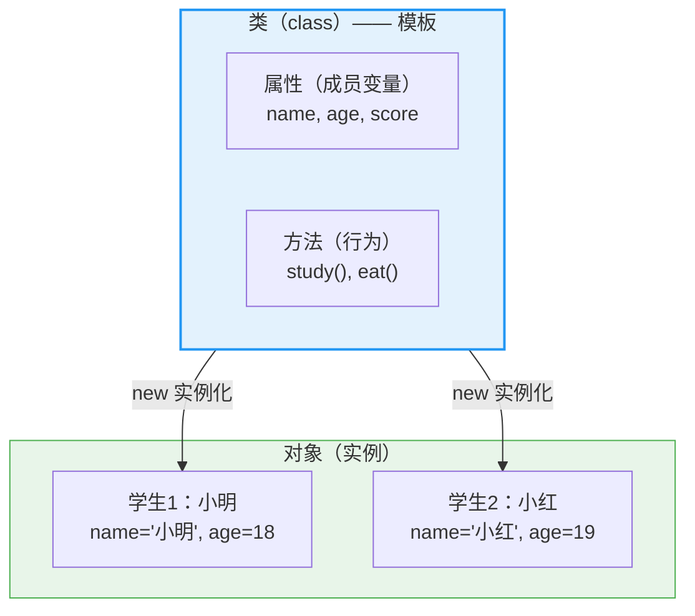

```java
// 定义类
public class Student {
    // 属性（成员变量）
    String name;
    int age;

    // 方法（行为）
    public void study() {
        System.out.println(name + "正在学习");
    }
}

// 创建对象（实例化）
public class Main {
    public static void main(String[] args) {
        Student s1 = new Student();  // 创建对象
        s1.name = "小明";            // 访问属性
        s1.age = 18;
        s1.study();                 // 调用方法

        Student s2 = new Student();
        s2.name = "小红";
        s2.age = 19;
        s2.study();
    }
}
```

### 类在内存中的表现（类加载与方法区）

类是 `.java` 源文件编译成 `.class` 字节码后，通过**类加载器**加载到 JVM 内存中的。

#### 类加载过程


#### 类在方法区中存储了哪些信息

当类加载完成后，类的结构信息被存储在 **方法区（Method Area）** 中（JDK8 后是**元空间 Metaspace**，使用本地内存）：

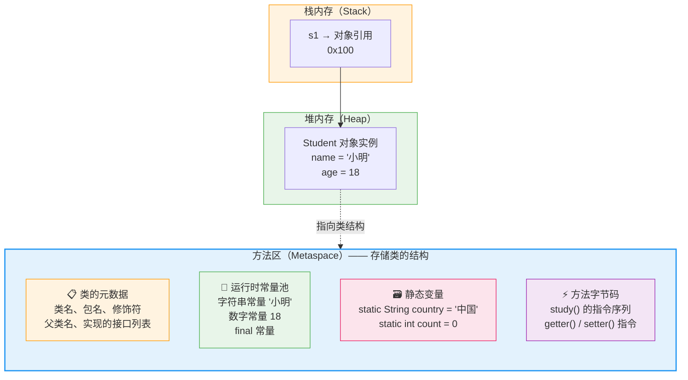

| 存储内容 | 说明 | 示例 |
|----------|------|------|
| **类的元数据** | 类名、包名、访问修饰符、父类、实现的接口 | `Student` → 父类 `Object`，实现无 |
| **运行时常量池** | 字面量（字符串、数字）和符号引用 | `"小明"`、`18`、`study` 方法引用 |
| **静态变量** | `static` 修饰的成员变量 | `static String country = "中国"` |
| **方法字节码** | 每个方法的 JVM 指令序列 | `study()` 的 `aload_0`、`getfield` 等 |
| **类加载器引用** | 记录由哪个类加载器加载 | `AppClassLoader` |

#### 完整的 Java 内存模型

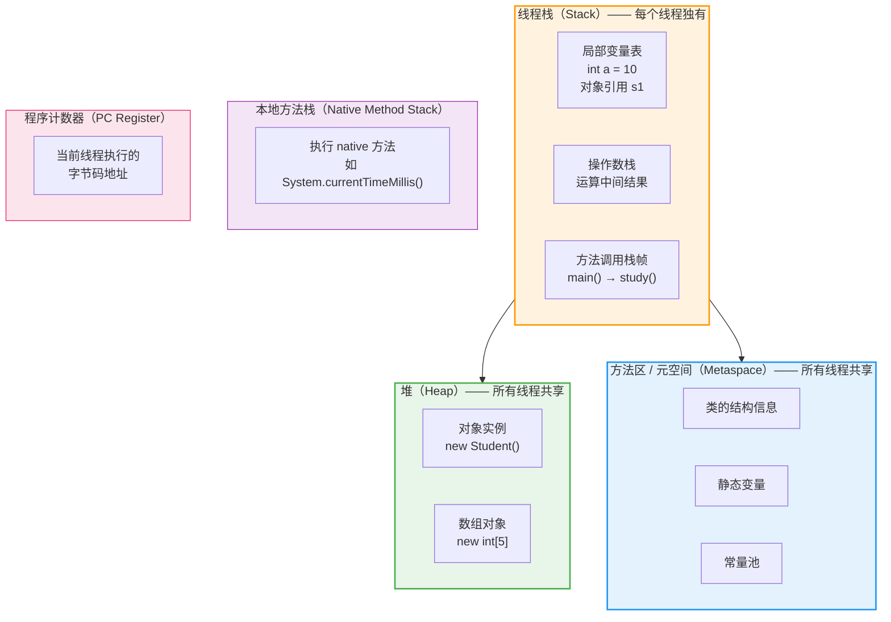

#### 关键结论

1. **类信息一份，对象多份** —— 方法区中类的结构只有一份，所有该类的对象实例都指向同一份类元数据
2. **静态变量属于类，不属于对象** —— `static` 变量存储在方法区，所有对象共享
3. **对象存储的是实例变量** —— 堆中每个对象单独保存自己的成员变量值
4. **方法字节码只存一份** —— 无论创建多少对象，方法的指令代码在方法区只有一份

### 对象在内存中的表现

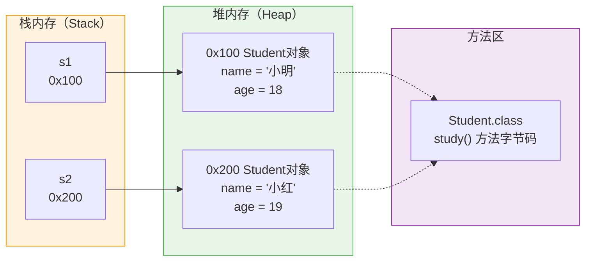

- **栈**：存储对象引用（地址）和局部变量
- **堆**：存储对象的实际数据（成员变量值）
- **方法区**：存储类的结构信息、静态变量、常量池和方法字节码
- 每个对象都通过内部指针指向方法区中自己的类结构

### 构造器（Constructor）

构造器用于创建对象时初始化属性。

```java
public class Student {
    String name;
    int age;

    // 无参构造器
    public Student() {
        System.out.println("创建了一个学生对象");
    }

    // 有参构造器（方法重载）
    public Student(String name, int age) {
        this.name = name;  // this 区分成员变量和参数
        this.age = age;
    }

    public void study() {
        System.out.println(name + "正在学习");
    }
}

// 使用
Student s1 = new Student();                    // 调用无参构造器
Student s2 = new Student("小明", 18);          // 调用有参构��器
```

> ⚠️ 如果类中没有定义任何构造器，JVM 会提供一个默认的无参构造器。一旦定义了有参构造器，默认构造器就失效了，建议**手动写出无参构造器**。

### this 关键字

`this` 代表当前对象，指向调用该方法的对象本身。

```java
public class Teacher {
    String name;

    // this 区分成员变量和局部变量
    public void setName(String name) {
        this.name = name;  // 左边的 name 是成员变量，右边的 name 是参数
    }

    // this 调用本类其他构造器
    public Teacher() {
        this("默认名字");  // 调用下面的有参构造器
    }

    public Teacher(String name) {
        this.name = name;
    }
}
```

### 封装（Encapsulation）

封装是将数据（属性）和方法（行为）包装在类中，通过**权限修饰符**控制外部访问。

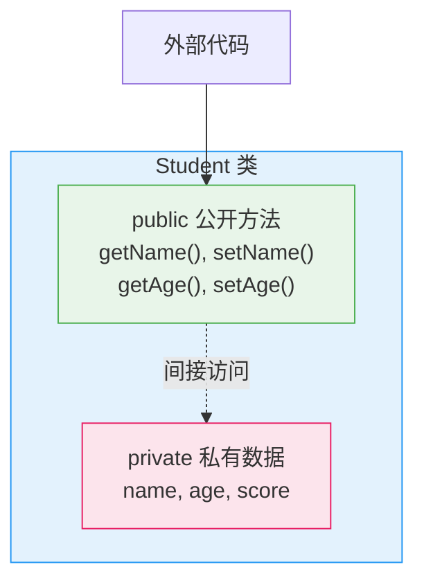

```java
public class Student {
    private String name;   // 私有属性，外部不能直接访问
    private int age;

    // 对外提供公开的 getter / setter
    public String getName() {
        return name;
    }

    public void setName(String name) {
        this.name = name;
    }

    public int getAge() {
        return age;
    }

    public void setAge(int age) {
        if (age > 0 && age < 150) {   // 可以在 setter 中加校验逻辑
            this.age = age;
        } else {
            System.out.println("年龄不合法");
        }
    }
}

// 使用
Student s = new Student();
s.setName("小明");
s.setAge(18);
System.out.println(s.getName());  // 小明
// s.name = "小红";  // ❌ 编译错误，private 不能直接访问
```

### 实体类（POJO / JavaBean）

实体类是只包含私有属性、getter/setter 和构造器的简单类，用于封装数据。

```java
public class User {
    private Long id;
    private String username;
    private String email;
    private int age;

    // 无参构造器（必须）
    public User() {}

    // 有参构造器
    public User(Long id, String username, String email, int age) {
        this.id = id;
        this.username = username;
        this.email = email;
        this.age = age;
    }

    // getter / setter
    public Long getId() { return id; }
    public void setId(Long id) { this.id = id; }
    public String getUsername() { return username; }
    public void setUsername(String username) { this.username = username; }
    public String getEmail() { return email; }
    public void setEmail(String email) { this.email = email; }
    public int getAge() { return age; }
    public void setAge(int age) { this.age = age; }
}
```

### static 关键字

`static` 表示静态的、属于**类级别**的成员，被所有对象共享。

```java
public class School {
    private String name;              // 实例变量，每个对象独有
    private static String country = "中国";  // 静态变量，所有对象共享
    private static int studentCount = 0;     // 统计学生总数

    public School(String name) {
        this.name = name;
        studentCount++;
    }

    // 实例方法
    public void showName() {
        System.out.println(this.name);
        System.out.println(country);    // 实例方法可以访问静态变量
    }

    // 静态方法
    public static void showCountry() {
        System.out.println(country);    // 静态方法只能访问静态成员
        // System.out.println(this.name); // ❌ 不能访问实例变量
    }

    public static int getStudentCount() {
        return studentCount;
    }
}

// 使用
School s1 = new School("清华");
School s2 = new School("北大");

System.out.println(School.getStudentCount()); // 2 —— 类名. 调用
System.out.println(School.country);           // "中国" —— 也可以通过类名直接访问
```

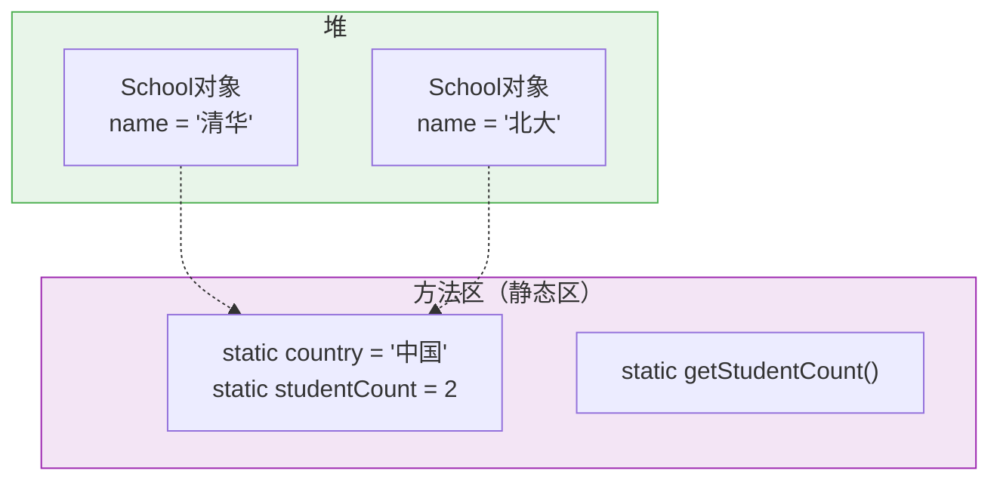

> 静态变量存在**方法区**的静态区，不随对象创建销毁，被所有对象共享。

### 继承（Inheritance）

继承让一个类（子类）获得另一个类（父类）的属性和方法，实现代码复用。

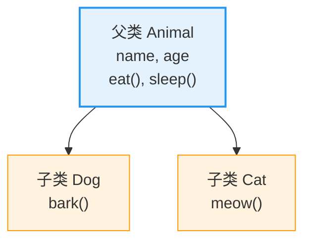

```java
// 父类
public class Animal {
    protected String name;
    protected int age;

    public void eat() {
        System.out.println(name + "在吃东西");
    }

    public void sleep() {
        System.out.println(name + "在睡觉");
    }
}

// 子类（extends 关键字）
public class Dog extends Animal {
    public void bark() {
        System.out.println(name + "在汪汪叫");
    }
}

public class Cat extends Animal {
    public void meow() {
        System.out.println(name + "在喵喵叫");
    }
}

// 使用
Dog dog = new Dog();
dog.name = "旺财";
dog.eat();    // 继承自父类
dog.bark();   // 子类特有

Cat cat = new Cat();
cat.name = "咪咪";
cat.sleep();  // 继承自父类
cat.meow();   // 子类特有
```

### 权限修饰符

| 修饰符 | 同一个类 | 同一个包 | 子类（不同包） | 任意位置 |
|--------|:--------:|:--------:|:--------------:|:--------:|
| `private` | ✅ | ❌ | ❌ | ❌ |
| 默认（不写） | ✅ | ✅ | ❌ | ❌ |
| `protected` | ✅ | ✅ | ✅ | ❌ |
| `public` | ✅ | ✅ | ✅ | ✅ |

```java
public class A {
    private int a = 1;       // 本类可见
    int b = 2;               // 本包可见
    protected int c = 3;     // 本包 + 子类可见
    public int d = 4;        // 全部可见

    private void m1() {}
    void m2() {}
    protected void m3() {}
    public void m4() {}
}
```

### 方法重写（Override）

子类对父类的方法进行重新实现。

```java
public class Animal {
    public void sound() {
        System.out.println("动物发出声音");
    }
}

public class Dog extends Animal {
    @Override  // 注解，检查是否���确重写（推荐加上）
    public void sound() {
        System.out.println("汪汪！");
    }
}

public class Cat extends Animal {
    @Override
    public void sound() {
        System.out.println("喵喵～");
    }
}

// 使用
Animal a1 = new Dog();
Animal a2 = new Cat();
a1.sound();  // 汪汪！
a2.sound();  // 喵喵～
```

重写规则：
- 方法名、参数列表必须**完全相同**
- 返回值类型必须**相同或为其子类**
- 访问权限**不能比父类更严格**
- `private` / `static` / `final` 方法**不能被重写**

### 子类构造器与 super

子类构造器**必须调用父类构造器**（显式或隐式），使用 `super` 关键字。

```java
public class Animal {
    protected String name;

    public Animal() {
        System.out.println("Animal 无参构造器");
    }

    public Animal(String name) {
        this.name = name;
        System.out.println("Animal 有参构造器");
    }
}

public class Dog extends Animal {
    private String breed;

    public Dog() {
        super();  // 隐式调用父类无参构造器（可以省略不写）
        System.out.println("Dog 无参构造器");
    }

    public Dog(String name, String breed) {
        super(name);                 // 显式调用父类有参构造器
        this.breed = breed;          // 再初始化自己的属性
        System.out.println("Dog 有参构造器");
    }
}

// 调用链
Dog d = new Dog("旺财", "金毛");
// 输出：
// Animal 有参构造器
// Dog 有参构造器
```

> ⚠️ `super()` 必须是子类构造器的**第一行语句**。如果父类没有无参构造器，子类构造器必须显式调用 `super(参数)`。

### super 关键字

```java
public class Parent {
    public String name = "父类名字";

    public void show() {
        System.out.println("父类方法");
    }
}

public class Child extends Parent {
    public String name = "子类名字";

    public void test() {
        System.out.println(name);       // 子类的 name
        System.out.println(super.name); // 父类的 name（用 super 访问父类被隐藏的成员）
    }

    @Override
    public void show() {
        super.show();                    // 调用父类被重写的方法
        System.out.println("子类方法");
    }
}
```

### 多态（Polymorphism）

**同一行为在不同对象上有不同的表现**。

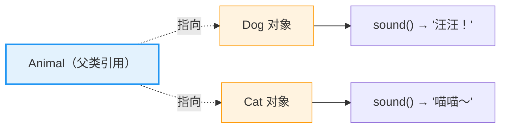

多态的三个条件：
1. **继承**（或实现接口）
2. **方法重写**
3. **父类引用指向子类对象**

```java
// 父类
class Animal {
    public void sound() { System.out.println("..."); }
}

class Dog extends Animal {
    @Override
    public void sound() { System.out.println("汪汪！"); }
}

class Cat extends Animal {
    @Override
    public void sound() { System.out.println("喵喵～"); }
}

public class Test {
    public static void main(String[] args) {
        // 父类引用指向子类对象 —— 多态
        Animal a1 = new Dog();
        Animal a2 = new Cat();

        a1.sound();  // 汪汪！（实际调用的是 Dog 的 sound）
        a2.sound();  // 喵喵～（实际调用的是 Cat 的 sound）

        // 多态的用处：统一处理不同子类
        Animal[] animals = {new Dog(), new Cat(), new Dog()};
        for (Animal a : animals) {
            a.sound();  // 每个对象调用自己的重写方法
        }

        // ❌ 编译错误：父类引用不能调用子类特有方法
        // a1.bark();  // bark() 是 Dog 特有的

        // 向下转型 —— 恢复子类特有方法
        if (a1 instanceof Dog) {
            Dog d = (Dog) a1;
            d.bark();  // ✅
        }
    }
}
```

### instanceof 关键字

检查对象是否属于某个类型，避免强制转换出错。

```java
Animal a = new Dog();

System.out.println(a instanceof Dog);    // true
System.out.println(a instanceof Cat);    // false
System.out.println(a instanceof Animal); // true

// 安全向下转型
if (a instanceof Dog) {
    Dog d = (Dog) a;
    d.bark();
}
```

### final 关键字

`final` 表示"不可改变的"：

```java
final int MAX_SIZE = 100;   // 常量：值不可修改
// MAX_SIZE = 200;  // ❌ 编译错误

// final 类：不能被继承
final class MathUtils {
    public static double pi() { return 3.14159; }
}
// class ExtendedMath extends MathUtils {}  // ❌ 编译错误

// final 方法：不能被重写
class Parent {
    public final void show() {
        System.out.println("固定实现");
    }
}
class Child extends Parent {
    // public void show() {}  // ❌ 编译错误
}

// final 修饰引用变量：地址不可变，但对象内容可变
final Student s = new Student("小明");
// s = new Student("小红");  // ❌ 编译错误
s.setName("小红");             // ✅ 对象内部可以修改
```

### 单例模式（Singleton）

确保一个类只有一个实例，提供全局访问点。

#### 饿汉式（线程安全，类加载时就创建）

```java
public class Singleton {
    // 类加载时就创建唯一实例
    private static final Singleton INSTANCE = new Singleton();

    // 私有构造器，防止外部 new
    private Singleton() {}

    // 全局访问点
    public static Singleton getInstance() {
        return INSTANCE;
    }
}

// 使用
Singleton s1 = Singleton.getInstance();
Singleton s2 = Singleton.getInstance();
System.out.println(s1 == s2);  // true
```

#### 懒汉式（延迟加载，使用时才创建）

```java
public class SingletonLazy {
    private static SingletonLazy instance;

    private SingletonLazy() {}

    // 加 synchronized 保证线程安全
    public static synchronized SingletonLazy getInstance() {
        if (instance == null) {
            instance = new SingletonLazy();
        }
        return instance;
    }
}
```

### 枚举（Enum）

枚举是一种特殊的类，用于定义一组**常量**。

```java
public enum Season {
    SPRING, SUMMER, AUTUMN, WINTER
}

// 使用
Season s = Season.SPRING;
System.out.println(s);  // SPRING

// 遍历
for (Season season : Season.values()) {
    System.out.println(season);
}

// 带属性和方法的枚举
public enum OrderStatus {
    PENDING(0, "待支付"),
    PAID(1, "已支付"),
    SHIPPED(2, "已发货"),
    COMPLETED(3, "已完成"),
    CANCELLED(4, "已取消");

    private final int code;
    private final String desc;

    OrderStatus(int code, String desc) {
        this.code = code;
        this.desc = desc;
    }

    public int getCode() { return code; }
    public String getDesc() { return desc; }
}

// 使用
OrderStatus status = OrderStatus.PAID;
System.out.println(status.getDesc());  // 已支付
```

### 抽象类（Abstract Class）

用 `abstract` 修饰的类，不能实例化，用于定义**抽象方法**（没有方法体的方法）。

```java
// 抽象类
public abstract class Shape {
    protected String color;

    public Shape(String color) {
        this.color = color;
    }

    // 普通方法
    public String getColor() {
        return color;
    }

    // 抽象方法（没有方法体，子类必须实现）
    public abstract double getArea();
    public abstract double getPerimeter();
}

// 子类实现抽象方法
public class Circle extends Shape {
    private double radius;

    public Circle(String color, double radius) {
        super(color);
        this.radius = radius;
    }

    @Override
    public double getArea() {
        return Math.PI * radius * radius;
    }

    @Override
    public double getPerimeter() {
        return 2 * Math.PI * radius;
    }
}

public class Rectangle extends Shape {
    private double width, height;

    public Rectangle(String color, double width, double height) {
        super(color);
        this.width = width;
        this.height = height;
    }

    @Override
    public double getArea() {
        return width * height;
    }

    @Override
    public double getPerimeter() {
        return 2 * (width + height);
    }
}

// 使用
Shape s = new Circle("红色", 5.0);
System.out.println(s.getArea());  // 78.5398...
```

> 抽象类可以有构造器、普通方法、成员变量，但不能被实例化。

### 接口（Interface）

接口是比抽象类更抽象的概念，定义了一组**规范**（方法签名），实现接口的类必须实现这些方法。

```java
// 定义接口
public interface Flyable {
    // 常量（默认 public static final）
    int MAX_SPEED = 1200;

    // 抽象方法（默认 public abstract）
    void fly();
    void land();
}

// 实现接口（implements）
public class Bird implements Flyable {
    private String name;

    public Bird(String name) {
        this.name = name;
    }

    @Override
    public void fly() {
        System.out.println(name + "在飞翔");
    }

    @Override
    public void land() {
        System.out.println(name + "降落了");
    }
}

// 一个类可以实现多个接口
public interface Swimable {
    void swim();
}

public class Duck implements Flyable, Swimable {
    @Override
    public void fly() { System.out.println("鸭子飞一会儿"); }

    @Override
    public void land() { System.out.println("鸭子降落"); }

    @Override
    public void swim() { System.out.println("鸭子游泳"); }
}
```

### JDK8 接口新增的三个方法

从 JDK8 开始，接口中可以有**默认方法**和**静态方法**。JDK9 新增了**私有方法**。

```java
public interface MyInterface {

    // 1. 抽象方法（子类必须实现）
    void abstractMethod();

    // 2. 默认方法（JDK8，有方法体，子类可以选择重写或继承）
    default void defaultMethod() {
        System.out.println("接口中的默认方法");
        privateMethod();  // 默认方法可以调用私有方法
    }

    // 3. 静态方法（JDK8，通过接口名直接调用）
    static void staticMethod() {
        System.out.println("接口中的静态方法");
        // privateStaticMethod();  // 静态方法可以调用私有静态方法
    }

    // 4. 私有方法（JDK9，在接口内部复用代码）
    private void privateMethod() {
        System.out.println("接口中的私有方法，JDK9");
    }

    // 5. 私有静态方法（JDK9）
    private static void privateStaticMethod() {
        System.out.println("接口中的私有静态方法，JDK9");
    }
}

// 使用
public class MyClass implements MyInterface {
    @Override
    public void abstractMethod() {
        System.out.println("实现抽象方法");
    }

    // 可以选择是否重写默认方法
    @Override
    public void defaultMethod() {
        System.out.println("重写了默认方法");
    }
}

// 调用
MyInterface.staticMethod();  // 接口名. 直接调用静态方法
MyClass obj = new MyClass();
obj.abstractMethod();
obj.defaultMethod();
```

### 抽象类 vs 接口对比

| 对比维度 | 抽象类 | 接口 |
|----------|--------|------|
| **关键字** | `abstract class` | `interface` |
| **继承方式** | `extends`（单继承） | `implements`（多实现） |
| **构造器** | ✅ 可以有 | ❌ 没有 |
| **成员变量** | 可以是任意类型 | `public static final` 常量 |
| **普通方法** | ✅ 可以有 | ❌（JDK8 前）✅ 默认/静态方法（JDK8+）|
| **抽象方法** | ✅ | ✅ |
| **访问修饰符** | 任意 | `public`（JDK9 有 private）|
| **设计思想** | **is-a** 关系（是什么） | **like-a** 能力（能做什么） |
| **使用场景** | 子类有共同属性和行为 | 定义行为规范，解耦 |

```java
// 抽象类：描述"是什么"
abstract class Animal {
    protected String name;
    public abstract void sound();
}

// 接口：描述"能做什么"
interface Runnable {
    void run();
}
interface Jumpable {
    void jump();
}

// 既继承又实现
class Dog extends Animal implements Runnable, Jumpable {
    @Override
    public void sound() { System.out.println("汪汪"); }
    @Override
    public void run() { System.out.println("跑"); }
    @Override
    public void jump() { System.out.println("跳"); }
}
```

### 代码块（初始化块）

```java
public class Person {
    private String name;

    // 1. 静态代码块（类加载时执行一次）
    static {
        System.out.println("静态代码块 —— 类加载时执行");
    }

    // 2. 实例代码块（每次创建对象时执行，在构造器之前）
    {
        System.out.println("实例代码块 —— 每次 new 都执行");
        // 可以对成员变量进行统一初始化
    }

    public Person() {
        System.out.println("构造器执行");
    }

    public Person(String name) {
        this.name = name;
        System.out.println("有参构造器执行");
    }
}

// 执行顺序
Person p1 = new Person();
// 输出：
// 静态代码块 —— 类加载时执行（仅第一次）
// 实例代码块 —— 每次 new 都执行
// 构造器执行

Person p2 = new Person("小明");
// 输出：
// 实例代码块 —— 每次 new 都执行
// 有参构造器执行（静态代码块不再执行）
```

### 内部类（Inner Class）

定义在类内部的类。

```java
public class Outer {
    private int num = 10;

    // 1. 成员内部类
    public class Inner {
        public void show() {
            System.out.println(num);  // 可以直接访问外部类的私有成员
        }
    }

    // 2. 静态内部类
    public static class StaticInner {
        public void print() {
            // System.out.println(num);  // ❌ 静态内部类不能访问实例成员
            System.out.println("静态内部类");
        }
    }

    // 3. 局部内部类（定义在方法中）
    public void method() {
        class LocalInner {
            public void test() {
                System.out.println("局部内部类");
            }
        }
        LocalInner li = new LocalInner();
        li.test();
    }

    public static void main(String[] args) {
        // 创建成员内部类
        Outer outer = new Outer();
        Outer.Inner inner = outer.new Inner();
        inner.show();

        // 创建静态内部类
        Outer.StaticInner si = new Outer.StaticInner();
        si.print();

        // 调用局部内部类
        outer.method();
    }
}
```

### 匿名内部类

没有名字的局部内部类，用于简化接口或抽象类的实现。

```java
// 接口
interface Hello {
    void sayHello();
    void sayBye();
}

public class Test {
    public static void main(String[] args) {
        // 匿名内部类 —— 直接 new 接口，现场实现方法
        Hello h = new Hello() {
            @Override
            public void sayHello() {
                System.out.println("你好！");
            }

            @Override
            public void sayBye() {
                System.out.println("再见！");
            }
        };
        h.sayHello();
        h.sayBye();

        // 匿名内部类简化事件监听（Swing 中常见）
        // button.addActionListener(new ActionListener() {
        //     @Override
        //     public void actionPerformed(ActionEvent e) {
        //         System.out.println("按钮被点击");
        //     }
        // });
    }
}
```

### 函数式编程与 Lambda 表达式

**函数式接口** —— 只有一个抽象方法的接口（可以用 `@FunctionalInterface` 注解标记）。

```java
@FunctionalInterface
interface Calculator {
    int calculate(int a, int b);
    // void otherMethod();  // ❌ 编译错误：函数式接口只能有一个抽象方法
}

public class LambdaDemo {
    public static void main(String[] args) {
        // 匿名内部类方式
        Calculator add1 = new Calculator() {
            @Override
            public int calculate(int a, int b) {
                return a + b;
            }
        };

        // Lambda 表达式方式（更简洁）
        Calculator add2 = (a, b) -> a + b;
        Calculator sub = (a, b) -> a - b;
        Calculator mul = (a, b) -> a * b;

        System.out.println(add2.calculate(3, 4));  // 7

        // 常用函数式接口
        // Predicate<T> —— 判断真假
        // Consumer<T> —— 消费数据
        // Function<T,R> —— 转换数据
        // Supplier<T> —— 提供数据

        // 多线程
        new Thread(() -> System.out.println("Lambda 创建线程")).start();
    }
}
```

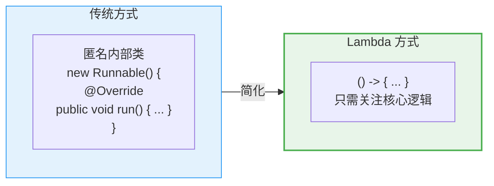

### 常用 API：String

```java
public class StringDemo {
    public static void main(String[] args) {
        // 创建字符串
        String s1 = "Hello";                    // 字面量（推荐）
        String s2 = new String("Hello");        // new 对象

        // 常用方法
        String str = "  Hello Java World!  ";

        // 长度
        System.out.println(str.length());              // 21

        // 获取字符
        System.out.println(str.charAt(2));             // 'H'

        // 截取子串
        System.out.println(str.substring(2, 7));       // "Hello"

        // 查找
        System.out.println(str.indexOf("Java"));       // 8
        System.out.println(str.contains("Java"));      // true
        System.out.println(str.startsWith("  He"));    // true

        // 判断相等
        System.out.println("abc".equals("abc"));       // true
        System.out.println("ABC".equalsIgnoreCase("abc")); // true

        // 转换
        System.out.println("hello".toUpperCase());     // "HELLO"
        System.out.println("HELLO".toLowerCase());     // "hello"

        // 去除空格
        System.out.println(str.trim());                // "Hello Java World!"

        // 替换
        System.out.println("a-b-c".replace("-", ",")); // "a,b,c"

        // 分割
        String[] parts = "apple,banana,orange".split(",");
        // parts = {"apple", "banana", "orange"}

        // 拼接
        String joined = String.join("-", "2024", "01", "15");
        // "2024-01-15"

        // 格式化
        String formatted = String.format("姓名：%s，年龄：%d", "小明", 18);
        // "姓名：小明，年龄：18"

        // StringBuilder —— 大量字符串拼接时使用
        StringBuilder sb = new StringBuilder();
        sb.append("Hello");
        sb.append(" ");
        sb.append("World");
        System.out.println(sb.toString());  // "Hello World"
    }
}
```

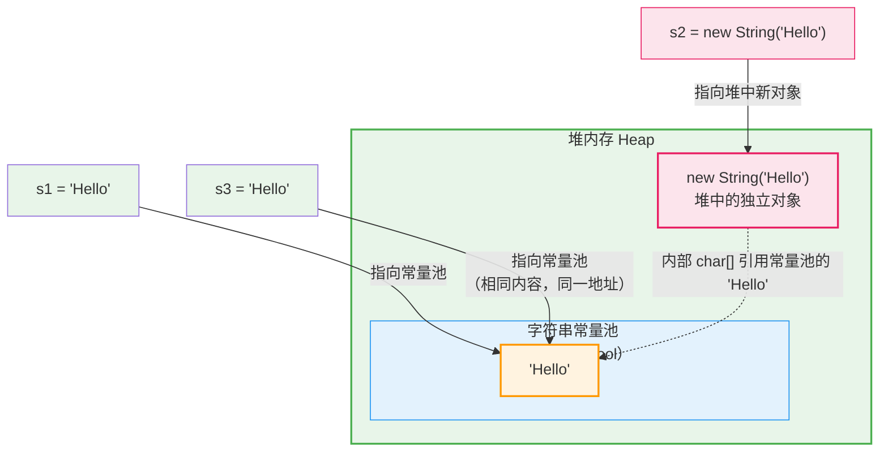

> **字符串常量池**：`"Hello"` 字面量会被放入常量池（JDK7+ 在堆中），相同内容的字面量 `s1` 和 `s3` 指向同一地址。
>
> **`new String("Hello")`**：参数中的 `"Hello"` 字面量**也会进入常量池**（如果还没有），但 `new` 关键字**额外在堆中创建一个新的 String 对象**，`s2` 指向这个新对象而不是常量池。因此 `s1 == s2` 为 `false`，`s1.equals(s2)` 为 `true`。

### 常用 API：ArrayList

`ArrayList` 是动态数组，可以自动扩容。

```java
import java.util.ArrayList;
import java.util.Collections;

public class ArrayListDemo {
    public static void main(String[] args) {
        // 创建
        ArrayList<String> list = new ArrayList<>();  // JDK7+ 泛型推断
        ArrayList<Integer> nums = new ArrayList<>(); // 引用类型，不能写 int

        // 增
        list.add("苹果");        // 末尾添加
        list.add("香蕉");
        list.add("橘子");
        list.add(1, "草莓");     // 指定位置插入

        // 删
        list.remove("香蕉");     // 按元素删除
        list.remove(0);          // 按索引删除

        // 改
        list.set(0, "西瓜");     // 修改指定位置的元素

        // 查
        System.out.println(list.get(0));          // 获取指定位置元素
        System.out.println(list.size());          // 长度
        System.out.println(list.contains("西瓜")); // 是否包含
        System.out.println(list.indexOf("橘子")); // 查找索引

        // 遍历
        // for 循环
        for (int i = 0; i < list.size(); i++) {
            System.out.println(list.get(i));
        }

        // 增强 for
        for (String fruit : list) {
            System.out.println(fruit);
        }

        // forEach + Lambda（JDK8）
        list.forEach(fruit -> System.out.println(fruit));

        // 存储基本类型 —— 使用包装类
        ArrayList<Integer> scores = new ArrayList<>();
        scores.add(85);    // 自动装箱：int → Integer
        scores.add(92);
        scores.add(78);

        int sum = 0;
        for (int score : scores) {  // 自动拆箱：Integer → int
            sum += score;
        }
        System.out.println("平均分：" + sum / scores.size());

        // 排序
        ArrayList<Integer> numbers = new ArrayList<>();
        numbers.add(5);
        numbers.add(3);
        numbers.add(8);
        numbers.add(1);
        Collections.sort(numbers);  // 升序排序
        System.out.println(numbers);  // [1, 3, 5, 8]
    }
}
```

### ArrayList 常用方法总结

| 方法 | 说明 |
|------|------|
| `add(E e)` | 末尾添加元素 |
| `add(int index, E e)` | 指定位置插入 |
| `remove(int index)` | 删除指定位置元素 |
| `remove(Object o)` | 删除第一次出现的指定元素 |
| `set(int index, E e)` | 修改指定位置的元素 |
| `get(int index)` | 获取指定位置的元素 |
| `size()` | 获取元素个数 |
| `contains(Object o)` | 是否包含指定元素 |
| `indexOf(Object o)` | 返回第一个匹配的索引 |
| `isEmpty()` | 是否为空 |
| `clear()` | 清空所有元素 |

## 异常（Exception）

异常是程序运行过程中出现的**不正常情况**，Java 通过异常处理机制让程序在出错时仍然能够优雅地处理。

### 异常体系

```mermaid
flowchart TB
    throwable["Throwable<br/>（可抛出的）"] --> error["Error<br/>（严重错误）"]
    throwable --> exception["Exception<br/>（异常）"]

    error --> outOfMemory["OutOfMemoryError<br/>内存溢出"]
    error --> stackOverflow["StackOverflowError<br/>栈溢出"]
    error --> noClassDef["NoClassDefFoundError<br/>类未找到"]

    exception --> runtime["RuntimeException<br/>（运行时异常）<br/>unchecked"]
    exception --> other["非运行时异常<br/>（编译时异常）<br/>checked"]

    runtime --> nullPtr["NullPointerException<br/>空指针"]
    runtime --> arrayIdx["ArrayIndexOutOfBoundsException<br/>数组越界"]
    runtime --> arithmetic["ArithmeticException<br/>算术异常"]
    runtime --> classCast["ClassCastException<br/>类型转换异常"]
    runtime --> numberFormat["NumberFormatException<br/>数字格式异常"]

    other --> io["IOException<br/>IO 异常"]
    other --> sql["SQLException<br/>SQL 异常"]
    other --> classNotFound["ClassNotFoundException<br/>类未找到"]

    style throwable fill:#fce4ec,stroke:#e91e63,stroke-width:2
    style error fill:#ffcdd2,stroke:#d32f2f
    style exception fill:#e3f2fd,stroke:#2196f3
    style runtime fill:#fff3e0,stroke:#ff9800
    style other fill:#e8f5e9,stroke:#4caf50
```

| 类别 | 特点 | 处理要求 | 常见例子 |
|------|------|----------|----------|
| **Error（错误）** | JVM 层面严重问题，程序无法处理 | 不捕获 | `OOM`、`StackOverflow` |
| **RuntimeException（运行时异常）** | 代码逻辑问题，可以在编码时避免 | 可选捕获（unchecked） | `NullPointerException` |
| **CheckedException（编译时异常）** | 外部因素，必须处理 | 必须捕获或抛出（checked） | `IOException`、`SQLException` |

### 异常的作用

```java
// 没有异常处理时 —— 程序直接崩溃
int[] arr = {1, 2, 3};
System.out.println(arr[5]);  // ❌ ArrayIndexOutOfBoundsException，程序终止

// 有异常处理 —— 优雅提示，程序继续运行
try {
    int[] arr = {1, 2, 3};
    System.out.println(arr[5]);
} catch (ArrayIndexOutOfBoundsException e) {
    System.out.println("数组下标越界了！" + e.getMessage());
}
System.out.println("程序继续运行...");  // 这行会执行
```

### 异常处理方案

#### try-catch-finally

```java
// 基本语法
try {
    // 可能出异常的代码
    int result = 10 / 0;              // ArithmeticException
} catch (ArithmeticException e) {
    // 捕获并处理异常
    System.out.println("除数不能为0");
    e.printStackTrace();              // 打印异常栈信息
} finally {
    // 无论是否发生异常，都会执行（通常用于释放资源）
    System.out.println("finally 始终执行");
}
```

#### 多 catch 块

```java
try {
    String str = null;
    System.out.println(str.length());  // NullPointerException
    int[] arr = new int[3];
    System.out.println(arr[5]);        // ArrayIndexOutOfBoundsException
} catch (NullPointerException e) {
    System.out.println("空指针异常");
} catch (ArrayIndexOutOfBoundsException e) {
    System.out.println("数组越界异常");
} catch (Exception e) {
    // 兜底：捕获所有其他异常
    System.out.println("其他异常：" + e.getMessage());
}
```

> 多个 catch 时，子类异常在前，父类异常在后（多态特性）。

#### 多重异常捕获（JDK7+）

```java
try {
    // 可能抛出多种异常
} catch (NullPointerException | ArrayIndexOutOfBoundsException e) {
    // 用 | 合并捕获多个异常
    System.out.println("异常类型：" + e.getClass().getSimpleName());
}
```

#### throws —— 声明抛出异常

```java
// 将异常抛给调用者处理
public void readFile(String path) throws IOException {
    if (path == null) {
        throw new IOException("文件路径不能为空");  // 主动抛出异常
    }
    // 读取文件...
}

// 调用者必须处理（CheckedException）
public void test() {
    try {
        readFile(null);
    } catch (IOException e) {
        System.out.println("文件读取失败");
    }
}
```

#### try-with-resources（JDK7+）

自动关闭实现了 `AutoCloseable` 接口的资源，不需要手动写 `finally`。

```java
// 传统方式 —— 需要 finally 关闭资源
BufferedReader br = null;
try {
    br = new BufferedReader(new FileReader("test.txt"));
    System.out.println(br.readLine());
} catch (IOException e) {
    e.printStackTrace();
} finally {
    if (br != null) {
        try { br.close(); } catch (IOException e) { }
    }
}

// try-with-resources —— 自动关闭
try (BufferedReader br = new BufferedReader(new FileReader("test.txt"))) {
    System.out.println(br.readLine());
} catch (IOException e) {
    e.printStackTrace();
}  // br 自动关闭，无需 finally
```

### 自定义异常

继承 `Exception`（编译时异常）或 `RuntimeException`（运行时异常）。

```java
// 自定义运行时异常
public class AgeOutOfRangeException extends RuntimeException {
    // 无参构造器
    public AgeOutOfRangeException() {
        super("年龄不在合法范围内");
    }

    // 带消息的构造器
    public AgeOutOfRangeException(String message) {
        super(message);
    }

    // 带消息和原因的构造器
    public AgeOutOfRangeException(String message, Throwable cause) {
        super(message, cause);
    }
}

// 使用
public class UserService {
    public void setAge(int age) {
        if (age < 0 || age > 150) {
            throw new AgeOutOfRangeException("年龄不合法：" + age);
        }
        System.out.println("年龄设置为：" + age);
    }
}

// 测试
public class Test {
    public static void main(String[] args) {
        UserService service = new UserService();
        try {
            service.setAge(200);  // 抛出 AgeOutOfRangeException
        } catch (AgeOutOfRangeException e) {
            System.out.println("捕获到自定义异常：" + e.getMessage());
        }
    }
}
```

```mermaid
flowchart LR
    throwable["Throwable"] --> exception2["Exception"]
    exception2 --> runtime2["RuntimeException"]
    runtime2 --> custom["AgeOutOfRangeException<br/>（自定义异常）"]

    style custom fill:#fff3e0,stroke:#ff9800,stroke-width:2
    style throwable fill:#fce4ec,stroke:#e91e63
```

## 泛型（Generics）

泛型是 JDK5 引入的特性，允许在定义类、接口和方法时使用**类型参数**，在编译时检查类型安全。

### 为什么需要泛型

```java
// 没有泛型 —— 需要强制类型转换，不安全
List list = new ArrayList();
list.add("Hello");
list.add(123);  // 可以添加任意类型，不安全

String s = (String) list.get(0);  // 需要强制转换
// String s2 = (String) list.get(1);  // ❌ 运行时 ClassCastException

// 有泛型 —— 编译时就检查类型安全
List<String> list2 = new ArrayList<>();
list2.add("Hello");
// list2.add(123);  // ❌ 编译错误，只能添加 String
String s2 = list2.get(0);  // 不需要强制转换
```

```mermaid
flowchart TB
    subgraph without["没有泛型"]
        w1["集合中存 Object<br/>取出来强制转换"]
        w2["运行时才报错<br/>不安全"]
    end
    subgraph with["使用泛型"]
        w3["类型参数化<br/>List&lt;String&gt;"]
        w4["编译时检查<br/>安全可靠"]
        w5["取出自动识别类型<br/>不用强转"]
    end

    without -->|"泛型解决"| with

    style without fill:#fce4ec,stroke:#e91e63
    style with fill:#e8f5e9,stroke:#4caf50,stroke-width:2
```

### 泛型类

```java
// 定义一个泛型类，T 是类型参数
public class Box<T> {
    private T value;          // 成员变量类型为 T

    public void set(T value) {
        this.value = value;
    }

    public T get() {
        return value;
    }
}

// 使用
Box<String> stringBox = new Box<>();   // JDK7+ 菱形语法
stringBox.set("Hello");
String s = stringBox.get();            // 自动识别为 String

Box<Integer> intBox = new Box<>();
intBox.set(100);
Integer num = intBox.get();            // 自动识别为 Integer
```

#### 多类型参数

```java
// 多个类型参数
public class Pair<K, V> {
    private K key;
    private V value;

    public Pair(K key, V value) {
        this.key = key;
        this.value = value;
    }

    public K getKey() { return key; }
    public V getValue() { return value; }
}

// 使用
Pair<String, Integer> pair = new Pair<>("年龄", 18);
System.out.println(pair.getKey() + "：" + pair.getValue());  // 年龄：18
```

### 泛型接口

```java
// 泛型接口
public interface Repository<T> {
    void save(T item);
    T findById(int id);
    List<T> findAll();
    void delete(int id);
}

// 实现泛型接口 —— 指定类型
public class UserRepository implements Repository<User> {
    private List<User> users = new ArrayList<>();

    @Override
    public void save(User user) {
        users.add(user);
    }

    @Override
    public User findById(int id) {
        return users.stream()
            .filter(u -> u.getId() == id)
            .findFirst()
            .orElse(null);
    }

    @Override
    public List<User> findAll() {
        return users;
    }

    @Override
    public void delete(int id) {
        users.removeIf(u -> u.getId() == id);
    }
}

// 实现泛型接口 —— 继续保持泛型（实现类也是泛型）
public class BaseRepository<T> implements Repository<T> {
    private List<T> data = new ArrayList<>();

    @Override
    public void save(T item) { data.add(item); }

    @Override
    public T findById(int id) {
        // 可以通过 id 查找，这里简化
        return data.get(id);
    }

    @Override
    public List<T> findAll() { return data; }

    @Override
    public void delete(int id) { data.remove(id); }
}
```

### 泛型方法

```java
public class Utils {
    // 静态泛型方法，<T> 写在返回值之前
    public static <T> T getLast(List<T> list) {
        return list.get(list.size() - 1);
    }

    // 多个类型参数
    public static <K, V> void printEntry(K key, V value) {
        System.out.println(key + " = " + value);
    }

    // 泛型方法也可以有边界
    public static <T extends Comparable<T>> T max(T a, T b) {
        return a.compareTo(b) > 0 ? a : b;
    }
}

// 使用
List<String> list = Arrays.asList("A", "B", "C");
String last = Utils.getLast(list);  // "C"

Utils.printEntry("name", "小明");    // name = 小明

System.out.println(Utils.max(3, 5));        // 5
System.out.println(Utils.max("abc", "xyz")); // "xyz"
```

### 泛型通配符

| 通配符 | 含义 | 示例 |
|--------|------|------|
| `?` | 任意类型 | `List<?>` |
| `? extends T` | T 或 T 的子类（上限） | `List<? extends Number>` |
| `? super T` | T 或 T 的父类（下限） | `List<? super Integer>` |

```java
public class WildcardDemo {
    // 只读 —— ? extends（生产者 Producer）
    public static double sum(List<? extends Number> list) {
        double total = 0;
        for (Number n : list) {
            total += n.doubleValue();
        }
        return total;
    }

    // 只写 —— ? super（消费者 Consumer）
    public static void addNumbers(List<? super Integer> list) {
        for (int i = 1; i <= 5; i++) {
            list.add(i);
        }
    }

    public static void main(String[] args) {
        List<Integer> ints = Arrays.asList(1, 2, 3);
        List<Double> doubles = Arrays.asList(1.5, 2.5, 3.5);
        System.out.println(sum(ints));     // 6.0
        System.out.println(sum(doubles));  // 7.5

        List<Number> nums = new ArrayList<>();
        List<Object> objs = new ArrayList<>();
        addNumbers(nums);  // ✅ Number 是 Integer 的父类
        addNumbers(objs);  // ✅ Object 是 Integer 的父类
    }
}
```

> PECS 原则：**Producer Extends, Consumer Super**（生产者用 extends，消费者用 super）

### 泛型的限制

```java
// ❌ 不能使用基本类型
// List<int> list = new ArrayList<>();     // 编译错误
List<Integer> list = new ArrayList<>();    // 必须使用包装类

// ❌ 不能创建泛型数组
// T[] arr = new T[10];                    // 编译错误

// ❌ 不能实例化类型参数
// T obj = new T();                        // 编译错误

// ❌ 静态成员不能引用类的类型参数
public class GenericClass<T> {
    // private static T item;              // 编译错误
}
```

## Collection 集合框架

```mermaid
flowchart TB
    collection["Collection&lt;E&gt;<br/>（单列集合）"] --> list["List&lt;E&gt;<br/>（有序、可重复）"]
    collection --> set["Set&lt;E&gt;<br/>（无序、不可重复）"]
    collection --> queue["Queue&lt;E&gt;<br/>（队列）"]

    map["Map&lt;K,V&gt;<br/>（双列集合）"]

    list --> arraylist["ArrayList<br/>数组实现<br/>查询快、增删慢"]
    list --> linkedlist["LinkedList<br/>链表实现<br/>增删快、查询慢"]
    list --> vector["Vector<br/>（古老、线程安全）"]

    set --> hashset["HashSet<br/>哈希表<br/>无序"]
    set --> treeset["TreeSet<br/>红黑树<br/>有序（排序）"]
    set --> linkedhashset["LinkedHashSet<br/>哈希+链表<br/>有序（插入顺序）"]

    map --> hashmap["HashMap"]
    map --> treemap["TreeMap"]
    map --> linkedhashmap["LinkedHashMap"]

    style collection fill:#e3f2fd,stroke:#2196f3,stroke-width:2
    style list fill:#fff3e0,stroke:#ff9800,stroke-width:2
    style set fill:#e8f5e9,stroke:#4caf50,stroke-width:2
    style queue fill:#f3e5f5,stroke:#9c27b0
    style map fill:#fce4ec,stroke:#e91e63,stroke-width:2
```

## List 集合

`List` 是有序、可重复的集合，常用实现类有 `ArrayList` 和 `LinkedList`。

### ArrayList

底层是**数组**，查询快（O(1)），增删慢（需要移动元素，O(n)）。

```java
import java.util.*;

public class ArrayListDemo {
    public static void main(String[] args) {
        // 创建
        List<String> list = new ArrayList<>();

        // 增
        list.add("A");           // 末尾添加
        list.add("B");
        list.add("C");
        list.add(1, "X");        // 指定位置插入 → [A, X, B, C]

        // 删
        list.remove(0);          // 按索引删除 → [X, B, C]
        list.remove("B");        // 按对象删除 → [X, C]

        // 改
        list.set(0, "Z");        // 修改指定位置 → [Z, C]

        // 查
        System.out.println(list.get(0));        // Z
        System.out.println(list.size());        // 2
        System.out.println(list.contains("Z")); // true
        System.out.println(list.indexOf("C"));  // 1

        // 遍历
        // 1. for 循环
        for (int i = 0; i < list.size(); i++) {
            System.out.println(list.get(i));
        }

        // 2. 增强 for
        for (String s : list) {
            System.out.println(s);
        }

        // 3. 迭代器
        Iterator<String> it = list.iterator();
        while (it.hasNext()) {
            String s = it.next();
            System.out.println(s);
        }

        // 4. forEach + Lambda
        list.forEach(System.out::println);

        // 转为数组
        String[] arr = list.toArray(new String[0]);

        // 清空
        list.clear();
    }
}
```

### ArrayList 扩容机制

```java
// ArrayList 默认初始容量为 10
List<String> list = new ArrayList<>();      // 初始容量 10
list.add("A");                              // 存入第 1 个
// ... 存到第 10 个，容量用满
list.add("K");                              // 第 11 个 → 扩容为 1.5 倍（10 + 5 = 15）
// 继续满 → 15 → 22 → 33...
```

```mermaid
flowchart LR
    subgraph init["new ArrayList()"]
        cap0["默认容量 10"]
    end
    subgraph full["存满 10 个"]
        cap1["[A, B, C, D, E, F, G, H, I, J]"]
    end
    subgraph grow["扩容 1.5 倍"]
        cap2["容量 15<br/>[A, B, C, D, E, F, G, H, I, J, K, ...]"]
    end

    init --> full --> grow

    style init fill:#e3f2fd,stroke:#2196f3
    style full fill:#fff3e0,stroke:#ff9800
    style grow fill:#e8f5e9,stroke:#4caf50
```

### LinkedList

底层是**双向链表**，增删快（只需修改指针，O(1)），查询慢（需要遍历，O(n)）。

```java
import java.util.*;

public class LinkedListDemo {
    public static void main(String[] args) {
        // 创建
        LinkedList<String> list = new LinkedList<>();

        // List 常规操作
        list.add("A");
        list.add("B");
        list.add("C");

        // LinkedList 特有的双端操作
        list.addFirst("First");       // 头部添加
        list.addLast("Last");         // 尾部添加

        System.out.println(list.getFirst());   // First
        System.out.println(list.getLast());    // Last

        list.removeFirst();            // 移除头部
        list.removeLast();             // 移除尾部

        // 可以用作栈
        LinkedList<String> stack = new LinkedList<>();
        stack.push("A");               // 入栈（头部）
        stack.push("B");
        stack.push("C");
        System.out.println(stack.pop());  // 出栈 → C（LIFO）

        // 可以用作队列
        LinkedList<String> queue = new LinkedList<>();
        queue.offer("A");              // 入队（尾部）
        queue.offer("B");
        queue.offer("C");
        System.out.println(queue.poll());  // 出队 → A（FIFO）
    }
}
```

```mermaid
flowchart LR
    head["head"]
    pre1["prev: null"] --> data1["data: A"] --> next1["next: →"]
    next1 --> pre2["prev: ←"] --> data2["data: B"] --> next2["next: →"]
    next2 --> pre3["prev: ←"] --> data3["data: C"] --> next3["next: null"]

    head --> data1

    style head fill:#fce4ec,stroke:#e91e63,stroke-width:2
    style data1 fill:#fff3e0,stroke:#ff9800
    style data2 fill:#fff3e0,stroke:#ff9800
    style data3 fill:#fff3e0,stroke:#ff9800
```

### ArrayList vs LinkedList

| 对比维度 | ArrayList | LinkedList |
|----------|-----------|------------|
| **底层结构** | 动态数组 | 双向链表 |
| **查询 get/set** | ✅ O(1)，快 | ❌ O(n)，需遍历 |
| **头部插入/删除** | ❌ O(n)，需移动元素 | ✅ O(1)，改指针即可 |
| **尾部插入** | ✅ O(1)（不需扩容时） | ✅ O(1) |
| **内存占用** | 少，只存数据 | 多，额外存 prev/next 指针 |
| **适用场景** | 查询多、尾部增删 | 头部/中间频繁增删、实现栈/队列 |

### List 常见算法

```java
public class ListAlgorithms {
    public static void main(String[] args) {
        List<Integer> list = new ArrayList<>(Arrays.asList(5, 3, 8, 1, 9, 2));

        // 排序（升序）
        Collections.sort(list);
        System.out.println(list);  // [1, 2, 3, 5, 8, 9]

        // 排序（降序）
        Collections.sort(list, Collections.reverseOrder());
        System.out.println(list);  // [9, 8, 5, 3, 2, 1]

        // 打乱顺序（洗牌）
        Collections.shuffle(list);

        // 反转
        Collections.reverse(list);

        // 二分查找（必须先排序）
        Collections.sort(list);
        int index = Collections.binarySearch(list, 5);
        System.out.println("5 的位置：" + index);

        // 最大值 / 最小值
        System.out.println(Collections.max(list));  // 9
        System.out.println(Collections.min(list));  // 1

        // 填充
        Collections.fill(list, 0);  // 全部填充为 0

        // 复制
        List<Integer> dest = new ArrayList<>(Arrays.asList(new Integer[list.size()]));
        Collections.copy(dest, list);

        // 线程安全包装
        List<Integer> syncList = Collections.synchronizedList(new ArrayList<>());
    }
}
```

### List 的迭代器

```java
public class IteratorDemo {
    public static void main(String[] args) {
        List<String> list = new ArrayList<>(Arrays.asList("A", "B", "C", "D"));

        // Iterator —— 单向遍历
        Iterator<String> it = list.iterator();
        while (it.hasNext()) {
            String s = it.next();
            if (s.equals("B")) {
                it.remove();  // 安全删除（不会触发 ConcurrentModificationException）
            }
        }
        System.out.println(list);  // [A, C, D]

        // ListIterator —— 双向遍历
        ListIterator<String> lit = list.listIterator();
        System.out.println(lit.next());     // A
        System.out.println(lit.next());     // C
        System.out.println(lit.previous()); // C（往回走）

        // 加强 for 循环（语法糖，底层也是 Iterator）
        for (String s : list) {
            System.out.println(s);
        }

        // ⚠️ 普通 for 循环删除元素需要注意
        List<String> list2 = new ArrayList<>(Arrays.asList("A", "B", "C", "D"));
        for (int i = 0; i < list2.size(); i++) {
            if (list2.get(i).equals("B")) {
                list2.remove(i);
                i--;  // 删除后下标回退，否则会跳过元素
            }
        }

        // ⚠️ 增强 for 循环中不能删除元素
        // for (String s : list) {
        //     if (s.equals("A")) {
        //         list.remove(s);  // ❌ ConcurrentModificationException
        //     }
        // }
    }
}
```

## Set 集合

`Set` 是**无序、不可重复**的集合，常用实现类有 `HashSet`、`LinkedHashSet` 和 `TreeSet`。

### Set 的特点

```java
import java.util.*;

public class SetDemo {
    public static void main(String[] args) {
        // Set 会自动去重
        Set<String> set = new HashSet<>();
        set.add("A");
        set.add("B");
        set.add("A");  // 重复，不会添加
        set.add("C");
        set.add("B");  // 重复，不会添加

        System.out.println(set);        // [A, B, C]（无序）
        System.out.println(set.size()); // 3（而非 5）
    }
}
```

### HashSet

底层是 **哈希表（HashMap）**，元素**无序**，查询/增删都是 O(1)。

```java
public class HashSetDemo {
    public static void main(String[] args) {
        Set<String> set = new HashSet<>();

        set.add("香蕉");
        set.add("苹果");
        set.add("橘子");
        set.add("苹果");  // ❌ 重复，忽略

        // 遍历（无序）
        for (String s : set) {
            System.out.println(s);
        }

        System.out.println(set.contains("香蕉"));   // true
        System.out.println(set.remove("橘子"));     // true
        System.out.println(set.size());             // 2
        set.clear();
        System.out.println(set.isEmpty());          // true
    }
}
```

```mermaid
flowchart LR
    subgraph hash["HashSet 内部结构（哈希表）"]
        b0["桶 0"] --> n0["null"]
        b1["桶 1"] --> n1["🍎<br/>(hash=1)"]
        b2["桶 2"]
        b3["桶 3"] --> n3["🍌<br/>(hash=3)"] --> n3next["🍊<br/>(hash=3)<br/>链表/红黑树解决冲突"]
        b4["桶 4"]
    end

    style hash fill:#e3f2fd,stroke:#2196f3,stroke-width:2
    style b0 fill:#f5f5f5
    style b1 fill:#fff3e0,stroke:#ff9800
    style b3 fill:#fff3e0,stroke:#ff9800
```

> HashSet 通过 `hashCode()` 决定存储位置，通过 `equals()` 判断重复。
> 所以自定义对象放到 HashSet 中，**必须重写 `hashCode()` 和 `equals()`**。

### LinkedHashSet

**哈希表 + 双向链表**，元素**按插入顺序排列**，比 HashSet 略慢但有序。

```java
Set<String> set = new LinkedHashSet<>();
set.add("香蕉");
set.add("苹果");
set.add("橘子");

System.out.println(set);  // [香蕉, 苹果, 橘子]（插入顺序，不会变）
```

### TreeSet

底层是**红黑树**，元素**自动排序**（自然顺序或自定义比较器），增删查 O(log n)。

```java
public class TreeSetDemo {
    public static void main(String[] args) {
        // 自然排序（升序）
        Set<Integer> numbers = new TreeSet<>();
        numbers.add(5);
        numbers.add(1);
        numbers.add(8);
        numbers.add(3);
        System.out.println(numbers);  // [1, 3, 5, 8]（自动排序）

        // 字符串按字典序排序
        Set<String> words = new TreeSet<>();
        words.add("Banana");
        words.add("Apple");
        words.add("Orange");
        System.out.println(words);  // [Apple, Banana, Orange]

        // 自定义排序（降序）
        Set<Integer> desc = new TreeSet<>((a, b) -> b - a);
        desc.addAll(Arrays.asList(5, 1, 8, 3));
        System.out.println(desc);  // [8, 5, 3, 1]

        // 自定义对象需要实现 Comparable
        Set<Student> students = new TreeSet<>((s1, s2) -> s1.getAge() - s2.getAge());
    }
}
```

### HashSet vs LinkedHashSet vs TreeSet

| 对比维度 | HashSet | LinkedHashSet | TreeSet |
|----------|---------|---------------|---------|
| **底层结构** | 哈希表 | 哈希表 + 双向链表 | 红黑树 |
| **元素顺序** | 无序 | 插入顺序 | 排序（自然/比较器） |
| **时间复杂度** | O(1) | O(1) | O(log n) |
| **是否允许 null** | ✅ 一个 null | ✅ 一个 null | ❌（JDK17 前允许一个）|
| **适用场景** | 通用去重 | 需要去重且保持插入顺序 | 需要自动排序 |

## Map 集合

`Map` 是**键值对（key-value）** 的集合，key 不可重复，每个 key 映射一个 value。

```mermaid
flowchart TB
    subgraph map["Map&lt;K, V&gt; 结构"]
        direction TB
        k1["key: 'name'"] --> v1["value: '小明'"]
        k2["key: 'age'"] --> v2["value: 18"]
        k3["key: 'score'"] --> v3["value: 95"]
    end

    style map fill:#e3f2fd,stroke:#2196f3,stroke-width:2
    style k1 fill:#fff3e0,stroke:#ff9800
    style k2 fill:#fff3e0,stroke:#ff9800
    style k3 fill:#fff3e0,stroke:#ff9800
    style v1 fill:#e8f5e9,stroke:#4caf50
    style v2 fill:#e8f5e9,stroke:#4caf50
    style v3 fill:#e8f5e9,stroke:#4caf50
```

### Map 常用 API

```java
import java.util.*;

public class MapDemo {
    public static void main(String[] args) {
        // 创建
        Map<String, Integer> map = new HashMap<>();

        // 增 / 改
        map.put("苹果", 10);     // 添加键值对
        map.put("香蕉", 5);
        map.put("橘子", 8);
        map.put("苹果", 20);     // key 相同 → 覆盖 value，返回旧值 10

        // 删
        map.remove("香蕉");      // 删除 key="香蕉" 的键值对

        // 查
        System.out.println(map.get("苹果"));      // 20
        System.out.println(map.get("西瓜"));      // null（不存在）
        System.out.println(map.getOrDefault("西瓜", 0));  // 0（不存在返回默认值）

        System.out.println(map.containsKey("苹果"));  // true
        System.out.println(map.containsValue(20));    // true
        System.out.println(map.size());               // 2

        // 遍历方式
        // 1. 遍历 entrySet（推荐）
        for (Map.Entry<String, Integer> entry : map.entrySet()) {
            System.out.println(entry.getKey() + " = " + entry.getValue());
        }

        // 2. 遍历 keySet
        for (String key : map.keySet()) {
            System.out.println(key + " = " + map.get(key));
        }

        // 3. 遍历 values
        for (Integer value : map.values()) {
            System.out.println(value);
        }

        // 4. forEach + Lambda
        map.forEach((k, v) -> System.out.println(k + " = " + v));
    }
}
```

### HashMap

底层是**数组 + 链表 / 红黑树**，查询/插入 O(1)。

```mermaid
flowchart TB
    subgraph hashmap["HashMap 内部结构"]
        direction TB
        subgraph table["Node[] table（数组）"]
            t0["tab[0]"]
            t1["tab[1]"]
            t2["tab[2]"]
            tn["..."]
        end
        subgraph chain["链表 / 红黑树<br/>（解决哈希冲突）"]
            c1["key='name' → val='小明'"]
            c2["key='nick' → val='明明'"]
        end
        t2 --> c1 --> c2
    end

    style hashmap fill:#e3f2fd,stroke:#2196f3,stroke-width:2
    style table fill:#fff3e0,stroke:#ff9800
    style chain fill:#fce4ec,stroke:#e91e63
```

#### HashMap 工作原理

| 特性 | 说明 |
|------|------|
| **默认容量** | 16（第一次 put 时初始化） |
| **负载因子** | 0.75（`容量 × 0.75` = 阈值） |
| **扩容** | 超过阈值时扩容为 **2 倍**（16 → 32 → 64...） |
| **哈希冲突** | 链表存储（JDK8+ 链表长度 > 8 时转为红黑树） |
| **key 为空** | 允许一个 null key（存在 table[0]） |

```java
Map<String, Integer> map = new HashMap<>();    // 默认容量 16
Map<String, Integer> map2 = new HashMap<>(32); // 指定初始容量，减少扩容

// 常用技巧
map.putIfAbsent("key", 100);  // key 不存在时才放入
map.merge("count", 1, Integer::sum);  // 如果存在则用函数合并（常用于计数）
map.computeIfAbsent("key", k -> k.length());  // key 不存在时计算并放入
```

### LinkedHashMap

**HashMap + 双向链表**，保持插入顺序（或访问顺序）。

```java
// 插入顺序（默认）
Map<String, Integer> map = new LinkedHashMap<>();
map.put("A", 1);
map.put("B", 2);
map.put("C", 3);
System.out.println(map);  // {A=1, B=2, C=3}（插入顺序）

// 访问顺序（配合 removeEldestEntry 可做 LRU 缓存）
Map<String, Integer> lru = new LinkedHashMap<>(16, 0.75f, true) {
    @Override
    protected boolean removeEldestEntry(Map.Entry<String, Integer> eldest) {
        return size() > 3;  // 最多保留 3 个
    }
};
lru.put("A", 1);
lru.put("B", 2);
lru.put("C", 3);
lru.get("A");         // 访问 A → A 移到末尾
lru.put("D", 4);      // 超过 3 个，移除最老的（B）
System.out.println(lru);  // {C=3, A=1, D=4}
```

### TreeMap

底层是**红黑树**，key **自动排序**。

```java
public class TreeMapDemo {
    public static void main(String[] args) {
        // 自然排序（key 升序）
        Map<Integer, String> map = new TreeMap<>();
        map.put(3, "C");
        map.put(1, "A");
        map.put(2, "B");
        System.out.println(map);  // {1=A, 2=B, 3=C}（按键排序）

        // 自定义排序
        Map<String, Integer> desc = new TreeMap<>((a, b) -> b.compareTo(a));
        desc.put("Banana", 5);
        desc.put("Apple", 3);
        desc.put("Orange", 8);
        System.out.println(desc);  // {Orange=8, Banana=5, Apple=3}

        // 取范围
        TreeMap<Integer, String> tm = new TreeMap<>();
        tm.put(1, "一");
        tm.put(3, "三");
        tm.put(5, "五");
        tm.put(7, "七");
        tm.put(9, "九");

        System.out.println(tm.firstKey());       // 1
        System.out.println(tm.lastKey());        // 9
        System.out.println(tm.lowerKey(5));      // 3（小于 5 的最大 Key）
        System.out.println(tm.higherKey(5));     // 7（大于 5 的最小 Key）
        System.out.println(tm.subMap(3, 8));     // {3=三, 5=五, 7=七}
    }
}
```

### HashMap vs LinkedHashMap vs TreeMap

| 对比维度 | HashMap | LinkedHashMap | TreeMap |
|----------|---------|---------------|---------|
| **底层结构** | 数组 + 链表/红黑树 | 数组 + 链表/红黑树 + 双向链表 | 红黑树 |
| **元素顺序** | 无序 | 插入/访问顺序 | key 排序 |
| **时间复杂度** | O(1) | O(1) | O(log n) |
| **允许 null key** | ✅ 一个 | ✅ 一个 | ❌（JDK17 前允许） |
| **适用场景** | 通用 | LRU 缓存、需要保持顺序 | 需要排序操作 |

## Stream 流

Stream 是 JDK8 引入的函数式数据处理方式，可以对集合进行**声明式**操作。

### 创建 Stream

```java
import java.util.*;
import java.util.stream.*;

public class StreamCreateDemo {
    public static void main(String[] args) {
        // 1. 从集合创建
        List<String> list = Arrays.asList("A", "B", "C");
        Stream<String> stream1 = list.stream();           // 串行流
        Stream<String> stream2 = list.parallelStream();   // 并行流

        // 2. 从数组创建
        String[] arr = {"A", "B", "C"};
        Stream<String> stream3 = Arrays.stream(arr);

        // 3. 直接创建
        Stream<String> stream4 = Stream.of("A", "B", "C");

        // 4. 无限流
        Stream<Integer> stream5 = Stream.iterate(0, i -> i + 1);           // 0,1,2,3...
        Stream<Double> stream6 = Stream.generate(() -> Math.random());     // 随机数

        // 5. 范围
        IntStream intStream = IntStream.range(1, 5);      // 1,2,3,4
        IntStream intStream2 = IntStream.rangeClosed(1, 5);  // 1,2,3,4,5
    }
}
```

### 中间操作

中间操作返回一个新的 Stream，**惰性执行**（不触发实际计算）。

```mermaid
flowchart LR
    source["数据源<br/>集合/数组"] --> filter["filter<br/>过滤"]
    filter --> map2["map<br/>转换"]
    map2 --> sorted["sorted<br/>排序"]
    sorted --> distinct["distinct<br/>去重"]
    distinct --> limit["limit<br/>截取"]
    limit --> terminal["终端操作<br/>(触发执行)"]

    style source fill:#e3f2fd,stroke:#2196f3,stroke-width:2
    style terminal fill:#fce4ec,stroke:#e91e63,stroke-width:2
```

```java
public class StreamIntermediateDemo {
    public static void main(String[] args) {
        List<String> list = Arrays.asList("Apple", "Banana", "Orange", "Apple", "Grape", "Kiwi");

        // filter —— 过滤
        list.stream()
            .filter(s -> s.startsWith("A"))
            .forEach(System.out::println);  // Apple

        // map —— 转换
        list.stream()
            .map(String::toUpperCase)
            .forEach(System.out::println);  // APPLE, BANANA, ORANGE...

        // distinct —— 去重
        list.stream()
            .distinct()
            .forEach(System.out::println);  // Apple, Banana, Orange, Grape, Kiwi

        // sorted —— 排序
        list.stream()
            .sorted()
            .forEach(System.out::println);  // Apple, Apple, Banana, Grape, Kiwi, Orange

        // sorted(Comparator) —— 自定义排序
        list.stream()
            .sorted((a, b) -> b.length() - a.length())  // 按长度降序
            .forEach(System.out::println);

        // limit —— 截取前 N 个
        list.stream()
            .limit(3)
            .forEach(System.out::println);  // Apple, Banana, Orange

        // skip —— 跳过前 N 个
        list.stream()
            .skip(2)
            .forEach(System.out::println);  // Orange, Apple, Grape, Kiwi

        // peek —— 调试用，中间查看（不会改变元素）
        List<String> result = list.stream()
            .peek(s -> System.out.println("处理前：" + s))
            .map(String::toUpperCase)
            .peek(s -> System.out.println("处理后：" + s))
            .collect(Collectors.toList());
    }
}
```

### 终端操作

终端操作会**触发 Stream 执行**，返回最终结果。

```java
public class StreamTerminalDemo {
    public static void main(String[] args) {
        List<Integer> numbers = Arrays.asList(1, 2, 3, 4, 5, 6, 7, 8, 9, 10);
        List<String> words = Arrays.asList("Java", "Python", "Go", "Rust", "JavaScript");

        // forEach —— 遍历
        numbers.stream().forEach(System.out::println);

        // collect —— 收集为集合
        List<Integer> evenList = numbers.stream()
            .filter(n -> n % 2 == 0)
            .collect(Collectors.toList());                // [2, 4, 6, 8, 10]

        Set<Integer> evenSet = numbers.stream()
            .filter(n -> n % 2 == 0)
            .collect(Collectors.toSet());                 // [2, 4, 6, 8, 10]

        Map<Integer, String> map = words.stream()
            .collect(Collectors.toMap(
                s -> s.length(),      // key：字符串长度
                s -> s,               // value：字符串本身
                (a, b) -> a + ", " + b  // key 冲突时合并
            ));

        // joining —— 拼接字符串
        String joined = words.stream()
            .collect(Collectors.joining(", "));
        System.out.println(joined);  // Java, Python, Go, Rust, JavaScript

        // count —— 计数
        long count = numbers.stream()
            .filter(n -> n > 5)
            .count();                // 5

        // reduce —— 归约
        int sum = numbers.stream()
            .reduce(0, (a, b) -> a + b);    // 55（求和）
        int product = numbers.stream()
            .reduce(1, (a, b) -> a * b);    // 3628800（求积）
        int max = numbers.stream()
            .reduce(Integer.MIN_VALUE, Integer::max);  // 10（求最大值）

        // min / max
        numbers.stream()
            .min(Integer::compareTo)
            .ifPresent(System.out::println);  // 1

        // anyMatch / allMatch / noneMatch —— 匹配
        System.out.println(words.stream().anyMatch(s -> s.length() > 5));   // true
        System.out.println(words.stream().allMatch(s -> s.length() > 1));   // true
        System.out.println(words.stream().noneMatch(s -> s.length() > 20)); // true

        // findFirst / findAny —— 查找
        words.stream()
            .filter(s -> s.startsWith("J"))
            .findFirst()
            .ifPresent(System.out::println);  // Java
    }
}
```

### 综合示例

```java
public class StreamDemo {
    public static void main(String[] args) {
        List<Student> students = Arrays.asList(
            new Student("小明", 18, 85),
            new Student("小红", 19, 92),
            new Student("小刚", 17, 76),
            new Student("小丽", 20, 95),
            new Student("小华", 18, 68)
        );

        // 需求：获取成绩 >= 80 的学生姓名，按成绩降序，取前 3 个
        List<String> topStudents = students.stream()
            .filter(s -> s.getScore() >= 80)        // 过滤成绩 >= 80
            .sorted((a, b) -> b.getScore() - a.getScore())  // 按成绩降序
            .limit(3)                                // 取前 3 个
            .map(Student::getName)                   // 提取姓名
            .collect(Collectors.toList());           // 收集为 List

        System.out.println(topStudents);  // [小丽, 小红, 小明]

        // 分组：按年龄分组
        Map<Integer, List<Student>> groupByAge = students.stream()
            .collect(Collectors.groupingBy(Student::getAge));
        System.out.println(groupByAge.get(18));  // [小明, 小华]

        // 统计
        IntSummaryStatistics stats = students.stream()
            .mapToInt(Student::getScore)
            .summaryStatistics();
        System.out.println("最高分：" + stats.getMax());    // 95
        System.out.println("最低分：" + stats.getMin());    // 68
        System.out.println("平均分：" + stats.getAverage());// 83.2
        System.out.println("总人数：" + stats.getCount()); // 5

        // 拼接
        String names = students.stream()
            .map(Student::getName)
            .collect(Collectors.joining(", "));
        System.out.println(names);  // 小明, 小红, 小刚, 小丽, 小华
    }
}

class Student {
    private String name;
    private int age;
    private int score;

    public Student(String name, int age, int score) {
        this.name = name;
        this.age = age;
        this.score = score;
    }

    public String getName() { return name; }
    public int getAge() { return age; }
    public int getScore() { return score; }

    @Override
    public String toString() {
        return name;
    }
}
```

### Collectors 工具类

```java
public class CollectorsDemo {
    public static void main(String[] args) {
        List<String> items = Arrays.asList("苹果", "香蕉", "橘子", "苹果", "葡萄");

        // toList / toSet / toMap
        List<String> list = items.stream().collect(Collectors.toList());
        Set<String> set = items.stream().collect(Collectors.toSet());
        Map<String, Integer> map = items.stream()
            .collect(Collectors.toMap(
                s -> s,
                s -> s.length(),
                (a, b) -> a  // key 重复时取第一个
            ));

        // joining
        String joined = items.stream().distinct()
            .collect(Collectors.joining(", ", "[", "]"));
        System.out.println(joined);  // [苹果, 香蕉, 橘子, 葡萄]

        // groupingBy —— 分组
        Map<Integer, List<String>> byLength = items.stream()
            .collect(Collectors.groupingBy(String::length));
        // {2=[苹果], 3=[香蕉], 2=[橘子], 2=[苹果], 3=[葡萄]}

        // partitioningBy —— 分区（true/false 两组）
        Map<Boolean, List<String>> partitioned = items.stream()
            .collect(Collectors.partitioningBy(s -> s.length() == 2));
        // {true=[苹果, 橘子, 苹果], false=[香蕉, 葡萄]}

        // counting —— 计数
        Map<Integer, Long> countByLen = items.stream()
            .collect(Collectors.groupingBy(String::length, Collectors.counting()));

        // mapping —— 分组后映射
        Map<Integer, List<Integer>> mapping = items.stream()
            .collect(Collectors.groupingBy(String::length,
                Collectors.mapping(String::length, Collectors.toList())));

        // averagingInt —— 平均值
        Double avg = items.stream()
            .collect(Collectors.averagingInt(String::length));
        System.out.println(avg);  // 2.4

        // summarizingInt —— 统计信息
        IntSummaryStatistics stats = items.stream()
            .collect(Collectors.summarizingInt(String::length));
    }
}
```

### Stream 注意事项

```java
public class StreamNoteDemo {
    public static void main(String[] args) {
        // ⚠️ Stream 只能消费一次
        Stream<String> stream = Stream.of("A", "B", "C");
        stream.forEach(System.out::println);
        // stream.forEach(System.out::println);  // ❌ IllegalStateException

        // ✅ 重新创建 Stream
        stream = Stream.of("A", "B", "C");  // 重新创建
        stream.forEach(System.out::println);

        // ⚠️ 惰性求值 —— 没有终端操作就不会执行
        Stream.of("A", "B", "C")
            .peek(System.out::println);   // ❌ 不会打印，因为没有终端操作

        // ⚠️ 并行流的线程安全问题
        List<Integer> list = new ArrayList<>();
        IntStream.range(0, 1000)
            .parallel()
            .forEach(list::add);           // ❌ 可能丢数据
        System.out.println(list.size());   // 可能小于 1000

        // ✅ 使用线程安全集合
        List<Integer> safeList = Collections.synchronizedList(new ArrayList<>());
        IntStream.range(0, 1000)
            .parallel()
            .forEach(safeList::add);
        System.out.println(safeList.size()); // 1000
    }
}
```

| 操作分类 | 方法 | 说明 |
|----------|------|------|
| **创建** | `stream()` / `parallelStream()` / `Stream.of()` / `Arrays.stream()` | 构建 Stream |
| **中间操作** | `filter` / `map` / `flatMap` / `distinct` / `sorted` / `limit` / `skip` / `peek` | 转换数据，惰性求值 |
| **终端操作** | `forEach` / `collect` / `count` / `reduce` / `min` / `max` / `anyMatch` / `findFirst` | 触发执行，返回结果 |

## File 类

`java.io.File` 是文件和目录路径名的抽象表示，可以创建、删除、重命名文件和目录，但**不能读写文件内容**。

### 创建 File 对象

```java
import java.io.File;

public class FileDemo {
    public static void main(String[] args) {
        // 3 种创建方式
        File f1 = new File("/Users/xxx/test.txt");           // 绝对路径
        File f2 = new File("test.txt");                       // 相对路径（项目根目录）
        File f3 = new File("docs", "readme.txt");            // 父路径 + 子路径
        File f4 = new File(new File("docs"), "readme.txt");  // File 对象 + 子路径

        System.out.println(f1);
    }
}
```

### File 常用方法

```java
public class FileMethodDemo {
    public static void main(String[] args) throws Exception {
        File f = new File("test.txt");

        // 创建
        boolean created = f.createNewFile();  // 创建新文件（不存在则创建）
        File dir = new File("mydir");
        dir.mkdir();                          // 创建单级目录
        new File("a/b/c").mkdirs();           // 创建多级目录（含父目录）

        // 判断
        System.out.println(f.exists());       // 是否存在
        System.out.println(f.isFile());       // 是否是文件
        System.out.println(f.isDirectory());  // 是否是目录
        System.out.println(f.canRead());      // 是否可读
        System.out.println(f.canWrite());     // 是否可写
        System.out.println(f.isHidden());     // 是否隐藏

        // 获取信息
        System.out.println(f.getName());      // test.txt（文件名）
        System.out.println(f.getPath());      // test.txt（构造时的路径）
        System.out.println(f.getAbsolutePath()); // /Users/xxx/.../test.txt（绝对路径）
        System.out.println(f.length());       // 文件大小（字节）
        System.out.println(f.lastModified()); // 最后修改时间（时间戳）

        // 删除
        f.delete();                           // 删除文件或空目录
        f.deleteOnExit();                     // JVM 退出时删除

        // 目录操作
        File dir2 = new File("/Users/xxx");
        String[] list = dir2.list();          // 返回文件名数组
        File[] files = dir2.listFiles();      // 返回 File 对象数组

        // 列出指定类型文件（FilenameFilter）
        File[] txtFiles = dir2.listFiles((dir, name) -> name.endsWith(".txt"));
    }
}
```

### 递归遍历目录

```java
public class ListFilesDemo {
    public static void main(String[] args) {
        File dir = new File("/Users/xxx");
        listAllFiles(dir, 0);
    }

    public static void listAllFiles(File file, int depth) {
        // 缩进
        StringBuilder indent = new StringBuilder();
        for (int i = 0; i < depth; i++) indent.append("  ");

        if (file.isFile()) {
            System.out.println(indent + "📄 " + file.getName());
        } else if (file.isDirectory()) {
            System.out.println(indent + "📁 " + file.getName());
            File[] children = file.listFiles();
            if (children != null) {
                for (File child : children) {
                    listAllFiles(child, depth + 1);
                }
            }
        }
    }
}
```

```mermaid
flowchart TB
    subgraph dir["📁 目录"]
        direction TB
        f1["📄 test.txt"]
        subgraph subDir["📁 subdir"]
            f2["📄 hello.java"]
            f3["📄 readme.md"]
        end
        f4["📄 data.csv"]
    end

    style dir fill:#e3f2fd,stroke:#2196f3,stroke-width:2
    style subDir fill:#fff3e0,stroke:#ff9800
```

## 字符集（Charset）

字符集是**字符与二进制之间的编码/解码规则表**。

```mermaid
flowchart LR
    char["字符 'A'"] --> encode["编码 encode<br/>字符 → 二进制"]
    encode --> binary["0100 0001"]
    binary --> decode["解码 decode<br/>二进制 → 字符"]
    decode --> char2["字符 'A'"]

    style char fill:#e8f5e9,stroke:#4caf50
    style binary fill:#fff3e0,stroke:#ff9800
    style char2 fill:#e8f5e9,stroke:#4caf50
```

### 常见字符集

| 字符集 | 说明 | 占用空间 | 特点 |
|--------|------|----------|------|
| **ASCII** | 美国信息交换标准代码 | 1 字节（实际 7 位） | 只能表示 128 个字符（英文、数字、符号） |
| **ISO-8859-1** | Latin-1，西欧语言 | 1 字节 | 兼容 ASCII，支持 256 个字符 |
| **GBK** | 汉字内码扩展规范 | 1~2 字节 | 中文编码，兼容 ASCII（英文 1 字节，中文 2 字节）|
| **UTF-8** | Unicode 的可变长度编码 | 1~4 字节 | ✅ **最常用**，兼容 ASCII，全球通用 |
| **UTF-16** | Unicode 的定长编码 | 2 或 4 字节 | Java 内部 `char` 使用 |
| **UTF-32** | Unicode 的定长编码 | 4 字节 | 固定长度，浪费空间 |

### UTF-8 编码规则

```
Unicode 范围          UTF-8 编码（二进制）
──────────────────────────────────────────────────
U+0000 ~ U+007F      0xxxxxxx                        （1 字节，兼容 ASCII）
U+0080 ~ U+07FF      110xxxxx 10xxxxxx               （2 字节）
U+0800 ~ U+FFFF      1110xxxx 10xxxxxx 10xxxxxx      （3 字节，常用汉字）
U+10000 ~ U+10FFFF   11110xxx 10xxxxxx 10xxxxxx 10xxxxxx  （4 字节，生僻字/emoji）
```

### Java 中的编码与解码

```java
import java.nio.charset.Charset;
import java.nio.charset.StandardCharsets;
import java.util.Arrays;

public class CharsetDemo {
    public static void main(String[] args) throws Exception {
        String str = "A中";

        // 查看支持的字符集
        System.out.println(Charset.availableCharsets());

        // 编码：String → byte[]
        byte[] utf8  = str.getBytes(StandardCharsets.UTF_8);        // [65, -28, -72, -83]（4 字节）
        byte[] gbk   = str.getBytes("GBK");                        // [65, -42, -48]（3 字节）
        byte[] iso   = str.getBytes("ISO-8859-1");                 // [65, 63]（"中" 无法表示，变成 63=?）

        System.out.println("UTF-8:" + Arrays.toString(utf8));      // [65, -28, -72, -83]
        System.out.println("GBK:" + Arrays.toString(gbk));         // [65, -42, -48]
        System.out.println("ISO-8859-1:" + Arrays.toString(iso));  // [65, 63]

        // 解码：byte[] → String
        String decoded = new String(utf8, StandardCharsets.UTF_8);
        System.out.println(decoded);  // A中

        // ⚠️ 乱码：编码与解码使用不同字符集
        String garbled = new String(gbk, StandardCharsets.UTF_8);
        System.out.println(garbled);  // A��（乱码）

        // 解决乱码：先还原为 byte[]，再用正确字符集解码
        byte[] originalBytes = garbled.getBytes(StandardCharsets.UTF_8);
        String fixed = new String(originalBytes, "GBK");
        System.out.println(fixed);  // A中
    }
}
```

## IO 流

IO 流用于处理**设备之间的数据传输**（文件、网络、键盘等）。

### IO 流分类

```mermaid
flowchart TB
    io["Java IO 流"] --> direction["按流向"]
    io --> unit["按数据类型"]

    direction --> input["输入流（读）<br/>InputStream / Reader"]
    direction --> output["输出流（写）<br/>OutputStream / Writer"]

    unit --> byte_stream["字节流<br/>InputStream / OutputStream"]
    unit --> char_stream["字符流<br/>Reader / Writer"]

    byte_stream --> file_byte["FileInputStream<br/>FileOutputStream"]
    byte_stream --> buffered_byte["BufferedInputStream<br/>BufferedOutputStream"]
    byte_stream --> object_stream["ObjectInputStream<br/>ObjectOutputStream"]
    byte_stream --> data_stream["DataInputStream<br/>DataOutputStream"]

    char_stream --> file_char["FileReader<br/>FileWriter"]
    char_stream --> buffered_char["BufferedReader<br/>BufferedWriter"]
    char_stream --> input_stream_reader["InputStreamReader<br/>OutputStreamWriter"]

    style io fill:#e3f2fd,stroke:#2196f3,stroke-width:2
    style direction fill:#fff3e0,stroke:#ff9800
    style unit fill:#e8f5e9,stroke:#4caf50
    style byte_stream fill:#fce4ec,stroke:#e91e63
    style char_stream fill:#f3e5f5,stroke:#9c27b0
```

| 维度 | 分类 | 核心抽象类 | 说明 |
|------|------|-----------|------|
| **流向** | 输入流 | `InputStream` / `Reader` | 读数据（从文件到程序）|
| | 输出流 | `OutputStream` / `Writer` | 写数据（从程序到文件）|
| **数据类型** | 字节流 | `InputStream` / `OutputStream` | 处理所有文件（图片、视频、文本）|
| | 字符流 | `Reader` / `Writer` | 处理文本文件（.txt、.java）|

### 字节流（FileInputStream / FileOutputStream）

```java
import java.io.*;

public class ByteStreamDemo {
    public static void main(String[] args) throws IOException {
        // 写文件
        FileOutputStream fos = new FileOutputStream("test.txt");
        // FileOutputStream fos2 = new FileOutputStream("test.txt", true); // 追加模式
        fos.write("Hello".getBytes());    // 写入字节数组
        fos.write("\nJava IO".getBytes());
        fos.close();                      // 释放资源

        // 读文件
        FileInputStream fis = new FileInputStream("test.txt");
        // 方式 1：一个字节一个字节读
        int b;
        while ((b = fis.read()) != -1) {
            System.out.print((char) b);  // Hello\nJava IO
        }
        fis.close();

        // 方式 2（推荐）：用 byte[] 缓冲区一次读一批
        FileInputStream fis2 = new FileInputStream("test.txt");
        byte[] buffer = new byte[1024];
        int len;
        while ((len = fis2.read(buffer)) != -1) {
            System.out.print(new String(buffer, 0, len));
        }
        fis2.close();

        // 方式 3（JDK9+）：try-with-resources 自动关闭
        try (FileInputStream in = new FileInputStream("test.txt");
             FileOutputStream out = new FileOutputStream("copy.txt")) {
            byte[] buf = new byte[1024];
            int n;
            while ((n = in.read(buf)) != -1) {
                out.write(buf, 0, n);
            }
        }  // 自动 close
    }
}
```

### 字符流（FileReader / FileWriter）

字符流专门处理**文本文件**，自动处理字符编码。

```java
public class CharStreamDemo {
    public static void main(String[] args) throws IOException {
        // 写（默认 UTF-8）
        try (FileWriter fw = new FileWriter("test.txt")) {
            fw.write("Hello Java");
            fw.write("\n你好，世界");
            fw.flush();  // 刷新缓冲区
        }

        // 读
        try (FileReader fr = new FileReader("test.txt")) {
            // 方式 1：逐个字符读
            int ch;
            while ((ch = fr.read()) != -1) {
                System.out.print((char) ch);
            }
        }

        // 方式 2：char[] 缓冲区
        try (FileReader fr = new FileReader("test.txt")) {
            char[] cbuf = new char[1024];
            int len;
            while ((len = fr.read(cbuf)) != -1) {
                System.out.print(new String(cbuf, 0, len));
            }
        }

        // 指定编码
        try (InputStreamReader isr = new InputStreamReader(
                new FileInputStream("test.txt"), "GBK")) {
            char[] cbuf = new char[1024];
            int len;
            while ((len = isr.read(cbuf)) != -1) {
                System.out.print(new String(cbuf, 0, len));
            }
        }
    }
}
```

### 缓冲流（BufferedInputStream / BufferedOutputStream / BufferedReader / BufferedWriter）

缓冲流在底层数组基础上再套一层**缓冲区**，减少 IO 次数，提高性能。

```mermaid
flowchart LR
    program["Java 程序"] --> buffered["缓冲流<br/>（缓冲区 8192 字节）"]
    buffered --> file_io["文件 / 网络"]
    program -. "没缓冲：每次直接 IO<br/>频繁磁盘读写" .-> file_io

    style program fill:#e8f5e9,stroke:#4caf50
    style buffered fill:#e3f2fd,stroke:#2196f3,stroke-width:2
    style file_io fill:#fff3e0,stroke:#ff9800
```

```java
public class BufferedStreamDemo {
    public static void main(String[] args) throws IOException {
        // BufferedInputStream / BufferedOutputStream（字节缓冲流）
        try (BufferedInputStream bis = new BufferedInputStream(
                new FileInputStream("source.mp4"));
             BufferedOutputStream bos = new BufferedOutputStream(
                new FileOutputStream("copy.mp4"))) {
            byte[] buffer = new byte[8192];
            int len;
            while ((len = bis.read(buffer)) != -1) {
                bos.write(buffer, 0, len);
            }
        }

        // BufferedReader / BufferedWriter（字符缓冲流，支持按行读写）
        try (BufferedReader br = new BufferedReader(
                new FileReader("test.txt"));
             BufferedWriter bw = new BufferedWriter(
                new FileWriter("copy.txt"))) {

            // 按行读取
            String line;
            while ((line = br.readLine()) != null) {  // ✅ readLine() 是 BufferedReader 特有的
                bw.write(line);
                bw.newLine();  // 换行（跨平台）
            }
        }
    }
}
```

### 转换流（InputStreamReader / OutputStreamWriter）

**字节流 ↔ 字符流**的桥梁，可以指定编码。

```java
public class ConvertStreamDemo {
    public static void main(String[] args) throws IOException {
        // 从文件读取 GBK 编码的文本
        try (BufferedReader br = new BufferedReader(
                new InputStreamReader(
                    new FileInputStream("gbk.txt"), "GBK"))) {
            String line;
            while ((line = br.readLine()) != null) {
                System.out.println(line);
            }
        }

        // 以 UTF-8 写入文件
        try (BufferedWriter bw = new BufferedWriter(
                new OutputStreamWriter(
                    new FileOutputStream("utf8.txt"), "UTF-8"))) {
            bw.write("你好，世界");
        }

        // 常用技巧：从控制台读（System.in 是 InputStream）
        try (BufferedReader console = new BufferedReader(
                new InputStreamReader(System.in))) {
            System.out.print("请输入：");
            String input = console.readLine();
            System.out.println("你输入了：" + input);
        }
    }
}
```

### 对象流（ObjectInputStream / ObjectOutputStream）

序列化：将 Java 对象转为字节序列保存到文件或网络传输。

```java
import java.io.*;

// 对象必须实现 Serializable 接口（标记接口，没有方法）
class Student implements Serializable {
    private static final long serialVersionUID = 1L;  // 版本号，保证反序列化一致性

    private String name;
    private int age;
    private transient String password;  // transient —— 不参与序列化

    public Student(String name, int age, String password) {
        this.name = name;
        this.age = age;
        this.password = password;
    }

    @Override
    public String toString() {
        return "Student{name='" + name + "', age=" + age + ", password='" + password + "'}";
    }
}

public class ObjectStreamDemo {
    public static void main(String[] args) throws Exception {
        // 序列化：对象 → 文件
        try (ObjectOutputStream oos = new ObjectOutputStream(
                new FileOutputStream("student.obj"))) {
            oos.writeObject(new Student("小明", 18, "123456"));
        }

        // 反序列化：文件 → 对象
        try (ObjectInputStream ois = new ObjectInputStream(
                new FileInputStream("student.obj"))) {
            Student s = (Student) ois.readObject();
            System.out.println(s);  // name='小明', age=18, password='null'（transient 丢失）
        }
    }
}
```

### IO 流选择指南

```mermaid
flowchart TB
    question["要处理什么类型的文件？"] --> isText{是文本文件？}
    isText -->|"是（.txt, .java, .md）"| text["使用字符流<br/>Reader / Writer"]
    isText -->|"否（图片、视频、音频）"| binary["使用字节流<br/>InputStream / OutputStream"]

    text --> needEncode{需要指定编码？}
    needEncode -->|"是"| convert["InputStreamReader<br/>OutputStreamWriter"]
    needEncode -->|"否"| fileRW["FileReader<br/>FileWriter"]

    binary --> needBuffer{需要提高性能？}
    needBuffer -->|"是"| buffered["BufferedInputStream<br/>BufferedOutputStream"]
    needBuffer -->|"否"| fileIO["FileInputStream<br/>FileOutputStream"]

    text --> needLine{需要按行读写？}
    needLine -->|"是"| bufferedChar["BufferedReader<br/>（readLine()）"]
    needLine -->|"否"| fileRW

    style question fill:#e3f2fd,stroke:#2196f3,stroke-width:2
    style text fill:#fff3e0,stroke:#ff9800
    style binary fill:#e8f5e9,stroke:#4caf50
```

### IO 流对比总结

| 流类型 | 类名 | 功能 | 特点 |
|--------|------|------|------|
| **字节输入** | `FileInputStream` | 读取字节数据（图片、视频） | 可读任何文件 |
| **字节输出** | `FileOutputStream` | 写入字节数据 | 追加模式 `new FileOutputStream(path, true)` |
| **字符输入** | `FileReader` | 读取文本文件 | 默认 UTF-8 |
| **字符输出** | `FileWriter` | 写入文本文件 | 默认 UTF-8 |
| **字节缓冲输入** | `BufferedInputStream` | 带缓冲的字节读取 | 提高性能 |
| **字节缓冲输出** | `BufferedOutputStream` | 带缓冲的字节写入 | 提高性能 |
| **字符缓冲输入** | `BufferedReader` | 带缓冲的字符读取 | **`readLine()`** 按行读取 |
| **字符缓冲输出** | `BufferedWriter` | 带缓冲的字符写入 | **`newLine()`** 跨平台换行 |
| **转换输入** | `InputStreamReader` | 字节→字符（指定编码） | 解决编码问题 |
| **转换输出** | `OutputStreamWriter` | 字符→字节（指定编码） | 指定输出编码 |
| **对象输入** | `ObjectInputStream` | 反序列化 | 读取 `Serializable` 对象 |
| **对象输出** | `ObjectOutputStream` | 序列化 | 写入 `Serializable` 对象 |

## 多线程

多线程允许程序**同时执行多个任务**，提高程序效率。Java 中线程是最小的执行单元，进程是最小的资源分配单元。

```mermaid
flowchart TB
    subgraph process["进程（Process）"]
        thread1["线程 1"]
        thread2["线程 2"]
        thread3["线程 3"]
        thread1 --> code1["代码"]
        thread2 --> code2["代码"]
        thread3 --> code3["代码"]
    end

    style process fill:#e3f2fd,stroke:#2196f3,stroke-width:2
    style thread1 fill:#fff3e0,stroke:#ff9800
    style thread2 fill:#fff3e0,stroke:#ff9800
    style thread3 fill:#fff3e0,stroke:#ff9800
```

### 创建线程的三种方式

#### 方式一：继承 Thread 类

```java
// 1. 继承 Thread
class MyThread extends Thread {
    @Override
    public void run() {
        // 线程要执行的任务
        for (int i = 0; i < 5; i++) {
            System.out.println(getName() + " 执行中：" + i);
        }
    }
}

// 2. 创建并启动
public class ThreadDemo {
    public static void main(String[] args) {
        MyThread t1 = new MyThread();
        MyThread t2 = new MyThread();

        t1.setName("线程1");
        t2.setName("线程2");

        t1.start();  // ✅ 启动线程（不要直接调用 run()！）
        t2.start();

        // main 线程也在运行
        System.out.println("main 线程结束");
    }
}
```

#### 方式二：实现 Runnable 接口（推荐）

```java
// 1. 实现 Runnable
class MyRunnable implements Runnable {
    @Override
    public void run() {
        for (int i = 0; i < 5; i++) {
            System.out.println(Thread.currentThread().getName() + "：" + i);
        }
    }
}

// 2. 创建并启动
public class RunnableDemo {
    public static void main(String[] args) {
        // 方式一
        Thread t1 = new Thread(new MyRunnable());
        t1.start();

        // 方式二：匿名内部类
        Thread t2 = new Thread(new Runnable() {
            @Override
            public void run() {
                System.out.println("匿名内部类线程");
            }
        });
        t2.start();

        // 方式三：Lambda 表达式（最简洁）
        Thread t3 = new Thread(() -> {
            System.out.println("Lambda 线程");
        });
        t3.start();
    }
}
```

> **实现 Runnable 接口优于继承 Thread 类**：Java 单继承，实现接口不影响继承其他类；更适合多个线程共享资源。

#### 方式三：实现 Callable 接口（有返回值）

```java
import java.util.concurrent.*;

class MyCallable implements Callable<String> {
    @Override
    public String call() throws Exception {
        // 模拟耗时计算
        Thread.sleep(1000);
        return "任务执行完毕，返回结果";
    }
}

public class CallableDemo {
    public static void main(String[] args) throws Exception {
        // 创建 FutureTask（Runnable 的增强版，可以获取返回值）
        FutureTask<String> futureTask = new FutureTask<>(new MyCallable());

        new Thread(futureTask).start();

        // 获取返回值（get() 会阻塞直到线程执行完毕）
        String result = futureTask.get();
        System.out.println(result);  // "任务执行完毕，返回结果"
    }
}
```

### 线程生命周期

```mermaid
flowchart TB
    new["① 新建<br/>new Thread()"] --> start["② 就绪<br/>start()"]
    start --> running["③ 运行<br/>获得 CPU 执行权"]
    running --> blocked["④ 阻塞<br/>sleep / wait / lock"]
    blocked --> start
    running --> dead["⑤ 死亡<br/>run() 结束 / stop()"]

    style new fill:#e3f2fd,stroke:#2196f3
    style start fill:#fff3e0,stroke:#ff9800
    style running fill:#e8f5e9,stroke:#4caf50,stroke-width:2
    style blocked fill:#fce4ec,stroke:#e91e63
    style dead fill:#f5f5f5,stroke:#666
```

| 状态 | 说明 | 触发方法 |
|------|------|----------|
| **新建（New）** | 创建了 Thread 对象，还没启动 | `new Thread()` |
| **就绪（Runnable）** | 可以被 CPU 调度执行了 | `start()` |
| **运行（Running）** | 正在执行 `run()` 方法 | 获得 CPU 时间片 |
| **阻塞（Blocked）** | 暂时让出 CPU，等待条件 | `sleep()` / `wait()` / 获取锁 |
| **死亡（Dead）** | 执行完毕或被终止 | `run()` 结束 / 异常 |

### 线程常用方法

```java
public class ThreadMethodDemo {
    public static void main(String[] args) throws Exception {
        // sleep —— 让当前线程休眠指定毫秒
        System.out.println("开始休眠");
        Thread.sleep(2000);  // 休眠 2 秒
        System.out.println("醒来");

        // join —— 等待某个线程执行完毕
        Thread t = new Thread(() -> {
            for (int i = 0; i < 3; i++) {
                System.out.println("子线程：" + i);
                try { Thread.sleep(500); } catch (Exception e) {}
            }
        });
        t.start();
        t.join();  // main 线程等待 t 执行完再继续
        System.out.println("子线程执行完了");

        // yield —— 让出 CPU（只是建议，不一定生效）
        Thread.yield();

        // daemon —— 守护线程（其他线程结束则自动结束）
        Thread daemon = new Thread(() -> {
            while (true) {
                System.out.println("守护线程运行中...");
            }
        });
        daemon.setDaemon(true);  // 必须在线程启动前设置
        daemon.start();

        // 线程优先级（1~10，默认 5）
        Thread t2 = new Thread(() -> {});
        t2.setPriority(Thread.MAX_PRIORITY);  // 10
        t2.setPriority(Thread.MIN_PRIORITY);  // 1
        t2.setPriority(Thread.NORM_PRIORITY); // 5
    }
}
```

### 线程安全问题

当**多个线程同时访问共享数据**时，可能出现数据不一致的问题。

```java
// 线程不安全的示例
class Counter {
    private int count = 0;

    public void increment() {
        count++;  // ❌ 不是原子操作（读取→修改→写入三步）
    }

    public int getCount() {
        return count;
    }
}

public class UnsafeDemo {
    public static void main(String[] args) throws Exception {
        Counter counter = new Counter();

        // 创建 1000 个线程，每个线程自增 1
        for (int i = 0; i < 1000; i++) {
            new Thread(() -> counter.increment()).start();
        }

        // 等待所有线程执行完毕
        Thread.sleep(2000);
        System.out.println("最终结果：" + counter.getCount());
        // ❌ 期望 1000，实际可能小于 1000（数据丢失）
    }
}
```

```mermaid
flowchart TB
    subgraph problem["线程安全问题演示<br/>count++ 的 3 步操作"]
        direction LR
        t1_start["线程 A：读取 count=0"] --> t1_add["线程 A：count+1=1"] --> t1_write["线程 A：写回 count=1 ✅"]
        t2_start["线程 B：读取 count=0"] --> t2_add["线程 B：count+1=1"] --> t2_write["线程 B：写回 count=1 ✅"]
    end
    mark["A 和 B 都读到 0<br/>两次加 1 结果却是 1<br/>❌ 少了一次"]

    t1_start ~~~ t2_start

    style problem fill:#fce4ec,stroke:#e91e63,stroke-width:2
    style mark fill:#fff3e0,stroke:#ff9800
```

### 线程同步

通过加锁解决线程安全问题，保证同一时刻**只有一个线程**访问共享资源。

#### synchronized 同步代码块

```java
class SafeCounter {
    private int count = 0;

    public void increment() {
        synchronized (this) {  // 锁住当前对象
            count++;  // 同一时刻只有一个线程能执行
        }
    }

    // 等价写法：synchronized 方法
    public synchronized void increment2() {
        count++;
    }

    public int getCount() {
        return count;
    }
}

public class SynchronizedDemo {
    public static void main(String[] args) throws Exception {
        SafeCounter counter = new SafeCounter();

        for (int i = 0; i < 1000; i++) {
            new Thread(() -> counter.increment()).start();
        }

        Thread.sleep(2000);
        System.out.println("最终结果：" + counter.getCount());
        // ✅ 1000（线程安全）
    }
}
```

#### synchronized 的三种用法

```java
public class SyncDemo {
    private int count = 0;
    private static int staticCount = 0;
    private final Object lock = new Object();  // 自定义锁对象

    // 1. 同步实例方法 —— 锁的是 this（当前对象）
    public synchronized void method1() {
        count++;
    }

    // 2. 同步静态方法 —— 锁的是 Class 对象
    public static synchronized void method2() {
        staticCount++;
    }

    // 3. 同步代码块（灵活，粒度更细）
    public void method3() {
        // 只锁需要同步的代码，不要锁整个方法
        synchronized (lock) {
            count++;
        }
        // 不需要同步的代码在锁外面执行
        System.out.println("不需要同步的操作");
    }
}
```

```mermaid
flowchart TB
    subgraph jvm_lock["JVM 中的 synchronized 锁"]
        thread_a["线程 A"] -->|"尝试获取锁"| lock_obj["锁对象"]
        thread_b["线程 B"] -->|"等待"| lock_obj
        lock_obj -->|"持有锁"| critical["同步代码块"]
        critical -->|"释放锁"| lock_obj
        lock_obj -->|"获取锁"| thread_b
        thread_b --> critical2["同步代码块"]
    end

    style thread_a fill:#e8f5e9,stroke:#4caf50
    style thread_b fill:#fff3e0,stroke:#ff9800
    style lock_obj fill:#fce4ec,stroke:#e91e63,stroke-width:2
```

### Lock 锁（JDK5+）

`java.util.concurrent.locks.Lock` 提供了比 `synchronized` 更灵活的锁操作。

```java
import java.util.concurrent.locks.*;

class LockCounter {
    private int count = 0;
    private final Lock lock = new ReentrantLock();  // 可重入锁

    public void increment() {
        lock.lock();  // 加锁
        try {
            count++;
        } finally {
            lock.unlock();  // ✅ 必须在 finally 中释放锁
        }
    }

    public int getCount() {
        return count;
    }
}
```

#### Lock 的常用方法

| 方法 | 说明 |
|------|------|
| `lock()` | 获取锁（阻塞等待） |
| `unlock()` | 释放锁 |
| `tryLock()` | 尝试获取锁（立即返回 boolean） |
| `tryLock(time, unit)` | 在指定时间内尝试获取锁 |
| `lockInterruptibly()` | 可中断的锁获取 |

#### Lock 的高级特性

```java
public class LockAdvancedDemo {
    public static void main(String[] args) throws Exception {
        ReentrantLock lock = new ReentrantLock();

        // tryLock —— 尝试获取锁，失败就放弃
        if (lock.tryLock()) {
            try {
                System.out.println("获取锁成功");
            } finally {
                lock.unlock();
            }
        } else {
            System.out.println("获取锁失败，执行其他操作");
        }

        // tryLock 超时
        if (lock.tryLock(3, TimeUnit.SECONDS)) {
            try {
                System.out.println("3秒内获取了锁");
            } finally {
                lock.unlock();
            }
        }

        // ReentrantLock 特性：可重入性
        lock.lock();
        lock.lock();  // ✅ 同一个线程可以再次获取锁（计数器 +1）
        System.out.println("重入次数：" + lock.getHoldCount());  // 2
        lock.unlock();
        lock.unlock();

        // 公平锁（按等待顺序获取锁，默认 false 是非公平锁）
        ReentrantLock fairLock = new ReentrantLock(true);  // true = 公平锁
    }
}
```

### synchronized vs Lock

| 对比维度 | synchronized | Lock |
|----------|-------------|------|
| **关键字/接口** | Java 关键字（JVM 层面） | 接口（JDK 层面） |
| **自动释放锁** | ✅ 执行完自动释放 | ❌ 必须手动 `unlock()` |
| **中断响应** | ❌ 不能中断等待 | ✅ `lockInterruptibly()` |
| **超时尝试** | ❌ | ✅ `tryLock(timeout)` |
| **公平性** | ❌ 非公平 | ✅ 可设置公平/非公平 |
| **多个条件** | ❌ | ✅ `Condition` 精准唤醒 |
| **性能** | JDK6+ 优化后接近 Lock | 高 |

### 死锁

两个或多个线程互相等待对方释放锁，导致程序卡死。

```java
public class DeadLockDemo {
    private static final Object LOCK_A = new Object();
    private static final Object LOCK_B = new Object();

    public static void main(String[] args) {
        // 线程 1：持有 LOCK_A，等待 LOCK_B
        new Thread(() -> {
            synchronized (LOCK_A) {
                System.out.println("线程1：持有 A，等待 B");
                try { Thread.sleep(100); } catch (Exception e) {}

                synchronized (LOCK_B) {  // 等线程2释放 B
                    System.out.println("线程1：拿到 B");
                }
            }
        }).start();

        // 线程 2：持有 LOCK_B，等待 LOCK_A
        new Thread(() -> {
            synchronized (LOCK_B) {
                System.out.println("线程2：持有 B，等待 A");
                try { Thread.sleep(100); } catch (Exception e) {}

                synchronized (LOCK_A) {  // 等线程1释放 A
                    System.out.println("线程2：拿到 A");
                }
            }
        }).start();
    }
}
```

```mermaid
flowchart TB
    thread1["线程 A"] -->|"持有"| lockA["锁 A"]
    thread1 -->|"等待"| lockB["锁 B"]
    thread2["线程 B"] -->|"持有"| lockB
    thread2 -->|"等待"| lockA

    style thread1 fill:#fff3e0,stroke:#ff9800
    style thread2 fill:#e8f5e9,stroke:#4caf50
    style lockA fill:#fce4ec,stroke:#e91e63
    style lockB fill:#fce4ec,stroke:#e91e63
```

**避免死锁的原则**：
- **固定加锁顺序**：所有线程按相同顺序获取锁（如先 A 后 B）
- **使用 tryLock**：获取不到就释放已持有的锁
- **缩小锁范围**：只在必要时加锁

### 线程通信（wait / notify）

```java
public class WaitNotifyDemo {
    public static void main(String[] args) {
        Object lock = new Object();

        // 消费者
        new Thread(() -> {
            synchronized (lock) {
                try {
                    System.out.println("消费者：等待生产...");
                    lock.wait();  // 释放锁并等待
                    System.out.println("消费者：收到通知，开始消费");
                } catch (Exception e) {}
            }
        }).start();

        // 生产者
        new Thread(() -> {
            synchronized (lock) {
                try {
                    Thread.sleep(2000);  // 模拟生产
                    System.out.println("生产者：生产完毕");
                    lock.notify();  // 唤醒等待的线程
                } catch (Exception e) {}
            }
        }).start();
    }
}
```

#### wait / notify 核心规则

| 方法 | 说明 | 必须在同步块内 |
|------|------|:--------------:|
| `wait()` | 当前线程释放锁并进入等待 | ✅ |
| `wait(long timeout)` | 等待指定毫秒后自动唤醒 | ✅ |
| `notify()` | 随机唤醒一个等待线程 | ✅ |
| `notifyAll()` | 唤醒所有等待线程 | ✅ |

### volatile 关键字

`volatile` 保证变量在**多线程间的可见性**，但不保证原子性。

```java
public class VolatileDemo {
    private volatile boolean running = true;  // volatile 保证修改对其他线程立即可见

    public void stop() {
        running = false;  // 修改 volatile 变量
    }

    public void work() {
        System.out.println("开始工作");
        while (running) {
            // 没有 volatile，这个循环可能永远不停止（每个线程缓存了 running）
        }
        System.out.println("停止工作");
    }

    public static void main(String[] args) throws Exception {
        VolatileDemo demo = new VolatileDemo();
        new Thread(demo::work).start();
        Thread.sleep(1000);
        demo.stop();  // 修改 running，让工作线程停止
    }
}
```

> `volatile` 适用于**一个线程写，多个线程读**的场景。多个线程同时写仍需 `synchronized`。

## 线程池

线程池预先创建一组线程，复用线程避免频繁创建销毁的开销。

### 为什么用线程池

```java
// ❌ 频繁创建、销毁线程 —— 性能差
for (int i = 0; i < 1000; i++) {
    new Thread(() -> {
        System.out.println("执行任务");
    }).start();
}

// ✅ 线程池复用线程 —— 性能好
ExecutorService pool = Executors.newFixedThreadPool(10);
for (int i = 0; i < 1000; i++) {
    pool.execute(() -> {
        System.out.println("执行任务");
    });
}
pool.shutdown();
```

### 常见的线程池

```java
import java.util.concurrent.*;

public class ThreadPoolDemo {
    public static void main(String[] args) {
        // 1. 固定线程数
        ExecutorService fixedPool = Executors.newFixedThreadPool(5);
        // 适用于：任务数量确定，并发可控

        // 2. 单个线程（保证任务顺序执行）
        ExecutorService singlePool = Executors.newSingleThreadExecutor();
        // 适用于：需要顺序执行的任务

        // 3. 缓存线程池（动态扩容）
        ExecutorService cachedPool = Executors.newCachedThreadPool();
        // 适用于：大量短任务

        // 4. 定时任务线程池
        ScheduledExecutorService scheduledPool = Executors.newScheduledThreadPool(3);
        // 适用于：定时/延迟执行

        // 提交任务
        fixedPool.execute(() -> System.out.println("Runnable 任务"));

        Future<String> future = fixedPool.submit(() -> {
            return "Callable 任务返回值";
        });

        // 关闭线程池
        fixedPool.shutdown();  // 不再接收新任务，等待已提交任务完成
        // fixedPool.shutdownNow();  // 立即关闭（尝试中断正在执行的任务）
    }
}
```

### 线程池底层原理：ThreadPoolExecutor

`Executors` 工具类创建的线程池底层都是 `ThreadPoolExecutor`。

```mermaid
flowchart TB
    submit["提交任务"] --> core{"核心线程<br/>是否已满？"}
    core -->|"否"| core_thread["创建核心线程执行"]
    core -->|"是"| queue{"工作队列<br/>是否已满？"}
    queue -->|"否"| waitQueue["放入队列等待"]
    queue -->|"是"| max{"最大线程<br/>是否已满？"}
    max -->|"否"| new_thread["创建临时线程执行"]
    max -->|"是"| reject["执行拒绝策略"]

    style submit fill:#e3f2fd,stroke:#2196f3
    style core_thread fill:#e8f5e9,stroke:#4caf50
    style waitQueue fill:#fff3e0,stroke:#ff9800
    style new_thread fill:#e8f5e9,stroke:#4caf50
    style reject fill:#fce4ec,stroke:#e91e63,stroke-width:2
```

```java
// ThreadPoolExecutor 核心构造参数
public ThreadPoolExecutor(
    int corePoolSize,       // 核心线程数（一直存活）
    int maximumPoolSize,    // 最大线程数
    long keepAliveTime,     // 临时线程存活时间
    TimeUnit unit,          // 时间单位
    BlockingQueue<Runnable> workQueue,  // 工作队列
    ThreadFactory threadFactory,        // 线程工厂
    RejectedExecutionHandler handler    // 拒绝策略
);

// 手动创建线程池（推荐，比 Executors 更可控）
public class ThreadPoolCreateDemo {
    public static void main(String[] args) {
        ThreadPoolExecutor executor = new ThreadPoolExecutor(
            2,                          // 核心线程数
            5,                          // 最大线程数
            60,                         // 空闲存活 60 秒
            TimeUnit.SECONDS,
            new ArrayBlockingQueue<>(10),  // 有界队列，容量 10
            Executors.defaultThreadFactory(),
            new ThreadPoolExecutor.AbortPolicy()  // 默认拒绝策略：抛异常
        );

        for (int i = 0; i < 20; i++) {
            int taskId = i;
            executor.execute(() -> {
                System.out.println(Thread.currentThread().getName() + " 执行任务 " + taskId);
            });
        }

        executor.shutdown();
    }
}
```

### 拒绝策略

| 策略 | 说明 |
|------|------|
| `AbortPolicy`（默认） | 抛 `RejectedExecutionException` |
| `CallerRunsPolicy` | 让提交任务的线程自己执行 |
| `DiscardPolicy` | 直接丢弃，不抛异常 |
| `DiscardOldestPolicy` | 丢弃队列中最旧的任务，再尝试提交 |

### 工作队列

| 队列 | 说明 |
|------|------|
| `ArrayBlockingQueue` | **有界**队列（推荐），容量固定 |
| `LinkedBlockingQueue` | 无界队列，可能导致 OOM |
| `SynchronousQueue` | 不存储任务，直接交给线程 |
| `PriorityBlockingQueue` | 优先级队列 |

### 线程池最佳实践

```java
public class ThreadPoolBestPractice {
    public static void main(String[] args) {
        // ✅ 推荐：手动创建 ThreadPoolExecutor
        ThreadPoolExecutor executor = new ThreadPoolExecutor(
            Runtime.getRuntime().availableProcessors(),      // 核心数 = CPU 核数
            Runtime.getRuntime().availableProcessors() * 2,   // 最大数
            60L,
            TimeUnit.SECONDS,
            new LinkedBlockingQueue<>(100),                   // 有界队列
            new ThreadPoolExecutor.CallerRunsPolicy()         // 让提交线程执行
        );

        // 监控线程池
        System.out.println("活跃线程数：" + executor.getActiveCount());
        System.out.println("已完成任务：" + executor.getCompletedTaskCount());
        System.out.println("队列中任务：" + executor.getQueue().size());

        // ⚠️ 提交任务时处理好异常
        executor.execute(() -> {
            try {
                // 业务代码
                int result = 1 / 0;  // 可能产生异常
            } catch (Exception e) {
                System.out.println("捕获异常：" + e.getMessage());
                // 记录日志等
            }
        });

        executor.shutdown();
    }
}
```

### 线程池工作流程总结

```mermaid
flowchart TB
    subgraph pool["线程池 ThreadPoolExecutor"]
        direction TB
        core["核心线程<br/>corePoolSize"]
        queue2["工作队列<br/>BlockingQueue"]
        temp["临时线程<br/>maximumPoolSize"]
        reject2["拒绝策略<br/>RejectedExecutionHandler"]
    end

    task["任务提交"] --> pool
    pool --> result["执行结果"]

    style pool fill:#e3f2fd,stroke:#2196f3,stroke-width:2
    style core fill:#e8f5e9,stroke:#4caf50
    style queue2 fill:#fff3e0,stroke:#ff9800
    style temp fill:#e8f5e9,stroke:#4caf50
    style reject2 fill:#fce4ec,stroke:#e91e63
```

| 参数 | 说明 | 建议 |
|------|------|------|
| `corePoolSize` | 核心线程数（一直存活） | CPU 密集型：N+1，IO 密集型：2N |
| `maximumPoolSize` | 最大线程数 | CPU 密集型：2N，IO 密集型：2N~4N |
| `workQueue` | 任务等待队列 | 必须用**有界队列**防 OOM |
| `keepAliveTime` | 临时线程空闲存活时间 | IO 密集型设大一些 |
| `handler` | 队列满+线程满时的处理 | `CallerRunsPolicy` 较友好 |

## 网络编程

网络编程让不同计算机上的程序通过**网络**进行数据交换。

### 网络模型（OSI / TCP/IP）

```mermaid
flowchart TB
    subgraph osi["OSI 七层模型"]
        osi7["7. 应用层<br/>HTTP / FTP / SMTP"]
        osi6["6. 表示层"]
        osi5["5. 会话层"]
        osi4["4. 传输层<br/>TCP / UDP"]
        osi3["3. 网络层<br/>IP"]
        osi2["2. 数据链路层"]
        osi1["1. 物理层"]
    end
    subgraph tcpip["TCP/IP 四层模型"]
        tcp4["4. 应用层<br/>HTTP / DNS / SSH"]
        tcp3["3. 传输层<br/>TCP / UDP"]
        tcp2["2. 网络层<br/>IP / ICMP"]
        tcp1["1. 网络接口层"]
    end

    osi4 --> tcp3
    osi3 --> tcp2

    style osi fill:#e3f2fd,stroke:#2196f3,stroke-width:2
    style tcpip fill:#e8f5e9,stroke:#4caf50,stroke-width:2
```

### 网络三要素

| 要素 | 说明 | 示例 |
|------|------|------|
| **IP 地址** | 标识网络中的设备 | `192.168.1.1`（IPv4）、`::1`（IPv6）|
| **端口号** | 标识设备上的具体进程（0~65535） | HTTP=80、HTTPS=443、MySQL=3306 |
| **协议** | 数据传输的规则 | TCP、UDP |

### InetAddress —— IP 地址类

```java
import java.net.*;

public class InetAddressDemo {
    public static void main(String[] args) throws Exception {
        // 获取本机 IP
        InetAddress local = InetAddress.getLocalHost();
        System.out.println(local.getHostName());    // 主机名
        System.out.println(local.getHostAddress()); // IP 地址

        // 根据域名获取 IP
        InetAddress baidu = InetAddress.getByName("www.baidu.com");
        System.out.println(baidu.getHostAddress()); // 百度服务器 IP

        // 获取所有 IP
        InetAddress[] all = InetAddress.getAllByName("www.baidu.com");
        for (InetAddress addr : all) {
            System.out.println(addr.getHostAddress());
        }

        // 判断是否可达（ping）
        System.out.println(local.isReachable(3000));  // true/false
    }
}
```

## UDP 通信

UDP（User Datagram Protocol）—— **用户数据报协议**。

### UDP 特点

| 特点 | 说明 |
|------|------|
| **无连接** | 不需要建立连接，直接发数据 |
| **不可靠** | 数据可能丢失、乱序，不重传 |
| **效率高** | 低延迟，开销小 |
| **面向数据报** | 以数据报为单位传输（最大 64KB） |
| **支持广播** | 可一对多发送 |

> 适用场景：视频直播、语音通话、DNS 查询、在线游戏（对实时性要求高，可容忍少量丢包）

### UDP 发送端

```java
import java.net.*;

public class UDPSender {
    public static void main(String[] args) throws Exception {
        // 1. 创建 DatagramSocket（发送端不需要指定端口）
        DatagramSocket socket = new DatagramSocket();

        // 2. 准备数据
        String msg = "Hello UDP!";
        byte[] data = msg.getBytes();

        // 3. 封装数据报（数据 + 目标 IP + 目标端口）
        InetAddress address = InetAddress.getByName("127.0.0.1");
        DatagramPacket packet = new DatagramPacket(
            data, 0, data.length, address, 8888
        );

        // 4. 发送
        socket.send(packet);
        System.out.println("UDP 数据已发送");

        // 5. 关闭
        socket.close();
    }
}
```

### UDP 接收端

```java
import java.net.*;

public class UDPReceiver {
    public static void main(String[] args) throws Exception {
        // 1. 创建 DatagramSocket（绑定端口，监听该端口）
        DatagramSocket socket = new DatagramSocket(8888);

        // 2. 准备接收容器
        byte[] buffer = new byte[1024];
        DatagramPacket packet = new DatagramPacket(buffer, buffer.length);

        System.out.println("UDP 接收端已启动，等待数据...");

        // 3. 接收（阻塞等待）
        socket.receive(packet);

        // 4. 解析数据
        int len = packet.getLength();                    // 实际接收的数据长度
        String msg = new String(packet.getData(), 0, len);
        String senderIP = packet.getAddress().getHostAddress();
        int senderPort = packet.getPort();

        System.out.println("收到来自 " + senderIP + ":" + senderPort + " 的消息：");
        System.out.println(msg);

        // 5. 关闭
        socket.close();
    }
}
```

```mermaid
sequenceDiagram
    participant Sender as 发送端
    participant UDP as UDP 网络
    participant Receiver as 接收端

    Sender->>UDP: 发送数据报（目标IP:端口）
    UDP->>Receiver: 传递数据报
    Note over Sender,Receiver: 无连接，不可靠<br/>速度快，延迟低
```

## TCP 通信

TCP（Transmission Control Protocol）—— **传输控制协议**。

### TCP 特点

| 特点 | 说明 |
|------|------|
| **面向连接** | 需先建立连接（三次握手）再传输数据 |
| **可靠传输** | 数据不丢失、不乱序、会重传 |
| **效率较低** | 相比 UDP，有连接建立和维护开销 |
| **面向字节流** | 无边界，以字节流形式传输 |
| **支持一对一** | 点对点通信 |

> 适用场景：网页浏览（HTTP）、文件传输（FTP）、邮件（SMTP）、数据库连接

### TCP 三次握手 / 四次挥手

```mermaid
sequenceDiagram
    participant Client as 客户端
    participant Server as 服务器端

    Note over Client,Server: === 三次握手（建立连接）===
    Client->>Server: SYN=1, seq=x（请求连接）
    Server->>Client: SYN=1, ACK=1, seq=y, ack=x+1（同意连接）
    Client->>Server: ACK=1, seq=x+1, ack=y+1（确认）
    Note over Client,Server: 连接建立成功，开始传输数据

    Note over Client,Server: === 四次挥手（关闭连接）===
    Client->>Server: FIN=1, seq=u（请求关闭）
    Server->>Client: ACK=1, seq=v, ack=u+1（确认关闭请求）
    Server->>Client: FIN=1, ACK=1, seq=w, ack=u+1（服务器关闭）
    Client->>Server: ACK=1, seq=u+1, ack=w+1（确认关闭）
    Note over Client,Server: 连接关闭
```

### TCP 客户端

```java
import java.io.*;
import java.net.*;

public class TCPClient {
    public static void main(String[] args) throws Exception {
        System.out.println("TCP 客户端启动，连接服务器...");

        // 1. 创建 Socket 连接服务器（IP + 端口）
        Socket socket = new Socket("127.0.0.1", 9999);
        System.out.println("连接成功！");

        // 2. 获取输出流，发送数据
        OutputStream os = socket.getOutputStream();
        PrintStream ps = new PrintStream(os);
        ps.println("你好服务器，我是客户端！");

        // 3. 获取输入流，接收服务器回复
        BufferedReader br = new BufferedReader(
            new InputStreamReader(socket.getInputStream())
        );
        String response = br.readLine();
        System.out.println("服务器回复：" + response);

        // 4. 关闭
        socket.close();
    }
}
```

### TCP 服务端

```java
import java.io.*;
import java.net.*;

public class TCPServer {
    public static void main(String[] args) throws Exception {
        System.out.println("TCP 服务端启动，等待连接...");

        // 1. 创建 ServerSocket，监听端口
        ServerSocket serverSocket = new ServerSocket(9999);

        // 2. 接受客户端连接（阻塞等待）
        Socket socket = serverSocket.accept();
        System.out.println("客户端已连接：" + socket.getInetAddress().getHostAddress());

        // 3. 获取输入流，读取客户端数据
        BufferedReader br = new BufferedReader(
            new InputStreamReader(socket.getInputStream())
        );
        String msg = br.readLine();
        System.out.println("收到客户端消息：" + msg);

        // 4. 获取输出流，回复客户端
        PrintStream ps = new PrintStream(socket.getOutputStream());
        ps.println("已收到你的消息！");

        // 5. 关闭
        socket.close();
        serverSocket.close();
    }
}
```

### TCP 实现多客户端通信

```java
import java.io.*;
import java.net.*;

// 服务端 —— 支持多个客户端
public class TCPMultiServer {
    public static void main(String[] args) throws Exception {
        ServerSocket serverSocket = new ServerSocket(9999);
        System.out.println("多客户端服务端已启动...");

        int clientNo = 0;
        while (true) {
            // 接受客户端连接
            Socket socket = serverSocket.accept();
            clientNo++;
            System.out.println("第 " + clientNo + " 个客户端已连接");

            // 每个客户端启动一个线程处理
            new Thread(new ClientHandler(socket, clientNo)).start();
        }
    }
}

// 处理单个客户端的任务
class ClientHandler implements Runnable {
    private Socket socket;
    private int clientNo;

    public ClientHandler(Socket socket, int clientNo) {
        this.socket = socket;
        this.clientNo = clientNo;
    }

    @Override
    public void run() {
        try {
            BufferedReader br = new BufferedReader(
                new InputStreamReader(socket.getInputStream())
            );
            PrintStream ps = new PrintStream(socket.getOutputStream());

            String msg;
            while ((msg = br.readLine()) != null) {
                System.out.println("客户端" + clientNo + "：" + msg);
                ps.println("服务器收到：客户端" + clientNo + " 说 " + msg);
            }

            socket.close();
            System.out.println("客户端" + clientNo + " 已断开");
        } catch (IOException e) {
            System.out.println("客户端" + clientNo + " 异常断开");
        }
    }
}

// 客户端
class TCPMultiClient {
    public static void main(String[] args) throws Exception {
        Socket socket = new Socket("127.0.0.1", 9999);

        // 发送消息线程
        new Thread(() -> {
            try {
                PrintStream ps = new PrintStream(socket.getOutputStream());
                BufferedReader console = new BufferedReader(
                    new InputStreamReader(System.in)
                );
                String input;
                while ((input = console.readLine()) != null) {
                    ps.println(input);
                    if ("exit".equals(input)) break;
                }
            } catch (IOException e) {}
        }).start();

        // 接收消息线程
        new Thread(() -> {
            try {
                BufferedReader br = new BufferedReader(
                    new InputStreamReader(socket.getInputStream())
                );
                String response;
                while ((response = br.readLine()) != null) {
                    System.out.println("服务器：" + response);
                }
            } catch (IOException e) {}
        }).start();
    }
}
```

### URL —— 统一资源定位符

```java
import java.net.*;

public class URLDemo {
    public static void main(String[] args) throws Exception {
        URL url = new URL("https://www.example.com:8080/path/file.html?name=java&version=17#section");

        System.out.println("协议：" + url.getProtocol());       // https
        System.out.println("主机：" + url.getHost());           // www.example.com
        System.out.println("端口：" + url.getPort());           // 8080（未指定返回 -1）
        System.out.println("路径：" + url.getPath());           // /path/file.html
        System.out.println("查询：" + url.getQuery());          // name=java&version=17
        System.out.println("锚点：" + url.getRef());            // section

        // 下载网页内容
        URL baidu = new URL("https://www.baidu.com");
        try (BufferedReader br = new BufferedReader(
                new InputStreamReader(baidu.openStream(), "UTF-8"))) {
            String line;
            while ((line = br.readLine()) != null) {
                System.out.println(line);
            }
        }
    }
}
```

### UDP vs TCP

```mermaid
flowchart TB
    subgraph udp_box["UDP 协议"]
        udp1["🔵 无连接"]
        udp2["🔵 不可靠"]
        udp3["🔵 速度快"]
        udp4["🔵 面向数据报"]
        udp5["🔵 支持广播"]
    end
    subgraph tcp_box["TCP 协议"]
        tcp1["🟢 面向连接"]
        tcp2["🟢 可靠传输"]
        tcp3["🟢 速度较慢"]
        tcp4["🟢 面向字节流"]
        tcp5["🟢 点对点"]
    end
    apps["应用场景"] --> udp_apps["视频直播<br/>语音通话<br/>在线游戏<br/>DNS 查询"]
    apps --> tcp_apps["网页浏览 HTTP<br/>文件传输 FTP<br/>邮件 SMTP<br/>数据库连接"]

    style udp_box fill:#e3f2fd,stroke:#2196f3,stroke-width:2
    style tcp_box fill:#e8f5e9,stroke:#4caf50,stroke-width:2
    style udp_apps fill:#e3f2fd,stroke:#2196f3
    style tcp_apps fill:#e8f5e9,stroke:#4caf50
```

| 对比维度 | UDP | TCP |
|----------|:---:|:---:|
| **连接** | 无连接 | 面向连接（三次握手） |
| **可靠性** | 不可靠（可能丢包） | 可靠（确认重传机制） |
| **速度** | 快 | 相对较慢 |
| **数据边界** | 数据报边界保留 | 字节流，无边界 |
| **传输模式** | 支持广播、多播 | 仅点对点 |
| **头部大小** | 8 字节 | 20~60 字节 |
| **应用场景** | 实时性要求高 | 数据完整性要求高 |
| **Java 核心类** | `DatagramSocket` / `DatagramPacket` | `Socket` / `ServerSocket` |

## JUnit 单元测试

JUnit 是 Java 最常用的单元测试框架，用于测试**最小的可测试单元**（通常是一个方法）。

### JUnit 基础

```java
import org.junit.jupiter.api.*;

public class CalculatorTest {
    // @BeforeAll —— 所有测试方法执行前运行一次（必须 static）
    @BeforeAll
    static void initAll() {
        System.out.println("初始化测试环境");
    }

    // @BeforeEach —— 每个测试方法执行前运行
    @BeforeEach
    void init() {
        System.out.println("准备测试数据");
    }

    // @Test —— 测试方法
    @Test
    void testAdd() {
        Calculator calc = new Calculator();
        int result = calc.add(2, 3);
        Assertions.assertEquals(5, result);  // 断言：期望值 5
    }

    @Test
    void testSubtract() {
        Calculator calc = new Calculator();
        Assertions.assertEquals(1, calc.subtract(3, 2));
    }

    // @AfterEach —— 每个测试方法执行后运行
    @AfterEach
    void tearDown() {
        System.out.println("清理测试数据");
    }

    // @AfterAll —— 所有测试方法执行后运行一次（必须 static）
    @AfterAll
    static void tearDownAll() {
        System.out.println("清理测试环境");
    }
}
```

### 常用断言

```java
public class AssertionDemo {
    @Test
    void testAssertions() {
        // 基本断言
        Assertions.assertEquals(4, 2 + 2);         // 相等
        Assertions.assertNotEquals(5, 2 + 2);      // 不相等
        Assertions.assertTrue(3 > 2);               // 为 true
        Assertions.assertFalse(3 < 2);              // 为 false
        Assertions.assertNull(null);                // 为 null
        Assertions.assertNotNull("hello");          // 不为 null

        // 数组断言
        int[] expected = {1, 2, 3};
        int[] actual = {1, 2, 3};
        Assertions.assertArrayEquals(expected, actual);  // 数组内容相等

        // 异常断言
        Assertions.assertThrows(ArithmeticException.class, () -> {
            int x = 1 / 0;
        });

        // 超时断言
        Assertions.assertTimeout(Duration.ofMillis(1000), () -> {
            Thread.sleep(500);
        });

        // 带失败消息
        Assertions.assertEquals(4, 2 + 2, "加法结果应为 4");
    }
}
```

### 特殊注解

```java
public class AdvancedTestDemo {
    // @Disabled —— 跳过测试
    @Test
    @Disabled("功能还在开发中")
    void testToSkip() {
        // 这个测试不会执行
    }

    // @DisplayName —— 自定义测试名称
    @Test
    @DisplayName("测试用户登录 ✅")
    void testLogin() {
        System.out.println("测试登录功能");
    }

    // @RepeatedTest —— 重复执行
    @RepeatedTest(value = 3, name = "重复第 {currentRepetition} 次")
    void testRepeated() {
        System.out.println("重复执行测试");
    }

    // 参数化测试
    @ParameterizedTest
    @ValueSource(ints = {1, 2, 3, 4, 5})
    void testWithParams(int num) {
        Assertions.assertTrue(num > 0);
    }

    // 嵌套测试
    @Nested
    @DisplayName("内部类的嵌套测试")
    class InnerTest {
        @Test
        void innerTestMethod() {
            Assertions.assertTrue(true);
        }
    }
}
```

## 反射（Reflection）

反射是 Java 的**动态机制**，允许程序在**运行时**获取类的信息并操作类的属性、方法和构造器。

### 获取 Class 对象的三种方式

```java
public class GetClassDemo {
    public static void main(String[] args) throws Exception {
        // 方式 1：Class.forName（最常用）
        Class<?> clazz1 = Class.forName("java.util.ArrayList");

        // 方式 2：类名.class
        Class<?> clazz2 = ArrayList.class;

        // 方式 3：对象.getClass()
        List<String> list = new ArrayList<>();
        Class<?> clazz3 = list.getClass();

        System.out.println(clazz1 == clazz2);  // true（同一个 Class 对象）
        System.out.println(clazz2 == clazz3);  // true

        System.out.println(clazz1.getName());       // java.util.ArrayList
        System.out.println(clazz1.getSimpleName()); // ArrayList
    }
}
```

### 反射操作构造器

```java
import java.lang.reflect.Constructor;

public class ConstructorReflectionDemo {
    public static void main(String[] args) throws Exception {
        Class<?> clazz = Class.forName("com.example.Student");

        // 获取所有公开构造器
        Constructor<?>[] constructors = clazz.getConstructors();

        // 获取所有构造器（包括私有）
        Constructor<?>[] allConstructors = clazz.getDeclaredConstructors();

        // 调用无参构造器创建对象
        Object obj = clazz.getConstructor().newInstance();

        // 调用有参构造器
        Constructor<?> constructor = clazz.getConstructor(String.class, int.class);
        Object student = constructor.newInstance("小明", 18);
    }
}
```

### 反射操作方法

```java
import java.lang.reflect.Method;

public class MethodReflectionDemo {
    public static void main(String[] args) throws Exception {
        Class<?> clazz = Class.forName("com.example.Student");
        Object obj = clazz.getConstructor().newInstance();
        Object obj2 = clazz.getConstructor(String.class, int.class)
            .newInstance("小明", 18);

        // 获取所有公开方法（包括父类继承的）
        Method[] methods = clazz.getMethods();

        // 获取本类所有方法（包括私有，不包括父类）
        Method[] declaredMethods = clazz.getDeclaredMethods();

        // 调用指定方法
        Method setNameMethod = clazz.getMethod("setName", String.class);
        setNameMethod.invoke(obj, "小红");

        Method getNameMethod = clazz.getMethod("getName");
        String name = (String) getNameMethod.invoke(obj);
        System.out.println(name);  // 小红

        // 调用私有方法
        Method privateMethod = clazz.getDeclaredMethod("secretMethod");
        privateMethod.setAccessible(true);  // 绕过 Java 访问检查
        privateMethod.invoke(obj);
    }
}
```

### 反射操作成员变量

```java
import java.lang.reflect.Field;

public class FieldReflectionDemo {
    public static void main(String[] args) throws Exception {
        Class<?> clazz = Class.forName("com.example.Student");
        Object obj = clazz.getConstructor().newInstance();

        // 获取所有公开字段
        Field[] fields = clazz.getFields();

        // 获取所有字段（包括私有）
        Field[] allFields = clazz.getDeclaredFields();

        // 修改字段值
        Field nameField = clazz.getDeclaredField("name");
        nameField.setAccessible(true);       // 私有字段需要设为可访问
        nameField.set(obj, "小明");

        // 获取字段值
        String name = (String) nameField.get(obj);
        System.out.println(name);  // 小明

        // 修改静态字段
        Field staticField = clazz.getDeclaredField("school");
        staticField.setAccessible(true);
        staticField.set(null, "清华大学");  // 静态字段传 null
    }
}
```

### 反射的应用场景

```mermaid
flowchart TB
    reflection["反射机制"] --> idea["IDE 智能提示"]
    reflection --> framework["框架核心"]
    reflection --> debug["调试工具"]
    reflection --> jdbc["JDBC 驱动加载"]

    framework --> spring["Spring IOC<br/>通过反射创建 Bean"]
    framework --> mybatis["MyBatis<br/>反射映射数据库字段"]
    framework --> hibernate["Hibernate<br/>ORM 映射"]

    style reflection fill:#e3f2fd,stroke:#2196f3,stroke-width:2
    style framework fill:#fff3e0,stroke:#ff9800,stroke-width:2
    style spring fill:#e8f5e9,stroke:#4caf50
    style mybatis fill:#e8f5e9,stroke:#4caf50
    style hibernate fill:#e8f5e9,stroke:#4caf50
```

### 反射的优缺点

| 优点 | 缺点 |
|------|------|
| ✅ 运行时动态操作对象 | ❌ 性能较低（比直接调用慢） |
| ✅ 框架核心基础（IOC、ORM） | ❌ 破坏封装性 |
| ✅ 提高代码灵活性 | ❌ 编译时无法检查错误 |
| ✅ 绕过访问权限检查 | ❌ 代码可读性下降 |

## 注解（Annotation）

注解是代码的**元数据**（描述代码的代码），可以标记在类、方法、字段等元素上，供编译器或运行时使用。

### 内置注解

```java
public class BuiltInAnnotationDemo {

    // @Override —— 标记方法重写
    @Override
    public String toString() {
        return "这个注解";
    }

    // @Deprecated —— 标记已过时
    @Deprecated
    public void oldMethod() {
        System.out.println("这个方法已过时");
    }

    // @SuppressWarnings —— 抑制编译器警告
    @SuppressWarnings("unchecked")
    public void suppressWarning() {
        List list = new ArrayList();  // 不会产生 unchecked 警告
    }

    // @FunctionalInterface —— 函数式接口（只有一个抽象方法）
    @FunctionalInterface
    interface MyFunction {
        void execute();
        // void otherMethod();  // ❌ 编译错误
    }
}
```

### 自定义注解

```java
import java.lang.annotation.*;

// 1. 定义注解（类似接口的定义方式）
public @interface MyAnnotation {
    // 注解属性（看起来像方法，实质是属性）
    String value() default "";       // 属性
    int count() default 1;
    String[] tags() default {};
}

// 2. 使用元注解修饰注解行为
@Target(ElementType.METHOD)          // 这个注解可以放在方法上
@Retention(RetentionPolicy.RUNTIME)  // 运行时保留（可通过反射读取）
@interface LogAnnotation {
    String operation() default "";
    String operator() default "system";
}

// 3. 使用自定义注解
class UserService {
    @LogAnnotation(operation = "查询用户", operator = "admin")
    public void getUser() {
        System.out.println("查询用户...");
    }

    @LogAnnotation(operation = "删除用户")
    public void deleteUser() {
        System.out.println("删除用户...");
    }
}
```

### 元注解

| 元注解 | 说明 | 取值示例 |
|--------|------|----------|
| `@Target` | 注解可以放置的位置 | `ElementType.METHOD` / `FIELD` / `TYPE` / `PARAMETER` |
| `@Retention` | 注解保留的策略 | `RetentionPolicy.SOURCE` / `CLASS` / `RUNTIME` |
| `@Documented` | 是否包含在 Javadoc 中 | |
| `@Inherited` | 子类是否继承此注解 | |
| `@Repeatable` | 注解是否可以重复标注（JDK8） | |

### 通过反射读取注解

```java
import java.lang.reflect.Method;

public class AnnotationReadDemo {
    public static void main(String[] args) throws Exception {
        // 获取类上的注解
        Class<?> clazz = UserService.class;

        // 获取方法上的注解
        Method method = clazz.getMethod("getUser");
        LogAnnotation log = method.getAnnotation(LogAnnotation.class);

        if (log != null) {
            System.out.println("操作：" + log.operation());   // 查询用户
            System.out.println("操作者：" + log.operator());  // admin
        }

        // 遍历所有方法上的注解
        for (Method m : clazz.getMethods()) {
            if (m.isAnnotationPresent(LogAnnotation.class)) {
                LogAnnotation anno = m.getAnnotation(LogAnnotation.class);
                System.out.println(m.getName() + " → " + anno.operation());
            }
        }

        // 判断是否有注解
        boolean hasAnno = method.isAnnotationPresent(LogAnnotation.class);
        System.out.println(hasAnno);  // true
    }
}
```

### 注解 + 反射实战 —— 简单 ORM 映射

```java
import java.lang.annotation.*;
import java.lang.reflect.Field;

// 定义注解
@Target(ElementType.TYPE)
@Retention(RetentionPolicy.RUNTIME)
@interface Table {
    String value();
}

@Target(ElementType.FIELD)
@Retention(RetentionPolicy.RUNTIME)
@interface Column {
    String value();
    boolean isPrimaryKey() default false;
}

// 使用注解
@Table("t_user")
class User {
    @Column(value = "id", isPrimaryKey = true)
    private Long id;

    @Column("username")
    private String username;

    @Column("email")
    private String email;

    // getter / setter...
}

// 读取注解生成 SQL
public class ORMDemo {
    public static void main(String[] args) {
        Class<User> clazz = User.class;

        // 获取表名
        Table table = clazz.getAnnotation(Table.class);
        String tableName = table.value();

        // 获取列名
        StringBuilder sql = new StringBuilder("SELECT ");
        Field[] fields = clazz.getDeclaredFields();
        for (int i = 0; i < fields.length; i++) {
            Column column = fields[i].getAnnotation(Column.class);
            if (column != null) {
                sql.append(column.value());
                if (i < fields.length - 1) sql.append(", ");
            }
        }
        sql.append(" FROM ").append(tableName);

        System.out.println(sql);
        // SELECT id, username, email FROM t_user
    }
}
```

## 代理（Proxy）

代理是一种设计模式，通过**代理对象**访问目标对象，可以在不修改原代码的前提下**增强功能**。

### 静态代理

手动编写代理类，每个目标类对应一个代理类。

```java
// 1. 定义接口
interface UserService {
    void save(String name);
    void delete(int id);
}

// 2. 目标类（真正业务逻辑）
class UserServiceImpl implements UserService {
    @Override
    public void save(String name) {
        System.out.println("保存用户：" + name);
    }

    @Override
    public void delete(int id) {
        System.out.println("删除用户 ID：" + id);
    }
}

// 3. 代理类（和目标类实现同一接口）
class UserServiceProxy implements UserService {
    private UserService target;  // 持有目标对象

    public UserServiceProxy(UserService target) {
        this.target = target;
    }

    @Override
    public void save(String name) {
        System.out.println("[日志] 准备保存用户");
        target.save(name);                     // 调用目标方法
        System.out.println("[日志] 用户已保存");
    }

    @Override
    public void delete(int id) {
        System.out.println("[日志] 准备删除用户");
        target.delete(id);
        System.out.println("[日志] 用户已删除");
    }
}

// 4. 使用
public class StaticProxyDemo {
    public static void main(String[] args) {
        UserService target = new UserServiceImpl();
        UserService proxy = new UserServiceProxy(target);
        proxy.save("小明");
        // 输出：
        // [日志] 准备保存用户
        // 保存用户：小明
        // [日志] 用户已保存
    }
}
```

```mermaid
flowchart TB
    client["客户端"] --> proxy_box["代理对象"]
    proxy_box --> pre["前置增强<br/>（日志/权限/事务）"]
    pre --> target_box["目标对象"]
    target_box --> post["后置增强"]

    style client fill:#e3f2fd,stroke:#2196f3
    style proxy_box fill:#fff3e0,stroke:#ff9800,stroke-width:2
    style target_box fill:#e8f5e9,stroke:#4caf50
    style pre fill:#fce4ec,stroke:#e91e63
    style post fill:#fce4ec,stroke:#e91e63
```

### JDK 动态代理

运行时**动态创建**代理对象，不需要手动编写代理类（要求目标类**必须实现接口**）。

```java
import java.lang.reflect.*;

// 1. 定义接口和目标类（同上）

// 2. InvocationHandler —— 拦截方法调用，加入增强逻辑
class LogHandler implements InvocationHandler {
    private Object target;  // 目标对象

    public LogHandler(Object target) {
        this.target = target;
    }

    @Override
    public Object invoke(Object proxy, Method method, Object[] args) throws Throwable {
        System.out.println("[日志] 调用方法：" + method.getName());

        // 前置增强
        long start = System.currentTimeMillis();

        // 调用目标方法
        Object result = method.invoke(target, args);

        // 后置增强
        long end = System.currentTimeMillis();
        System.out.println("[日志] " + method.getName() + " 执行耗时：" + (end - start) + "ms");

        return result;
    }
}

// 3. 创建代理对象
public class JDKProxyDemo {
    public static void main(String[] args) {
        // 目标对象
        UserService target = new UserServiceImpl();

        // 创建代理对象
        UserService proxy = (UserService) Proxy.newProxyInstance(
            target.getClass().getClassLoader(),     // 类加载器
            target.getClass().getInterfaces(),      // 接口数组
            new LogHandler(target)                  // InvocationHandler
        );

        // 调用代理方法
        proxy.save("小明");
        proxy.delete(1);

        // 代理对象类型
        System.out.println(proxy.getClass().getName());
        // com.sun.proxy.$Proxy0
    }
}
```

### CGLIB 动态代理（第三方库）

不需要接口，通过**继承**目标类生成子类作为代理。

```java
import net.sf.cglib.proxy.*;

// 1. 目标类（不需要接口）
class UserDao {
    public void save(String name) {
        System.out.println("保存用户：" + name);
    }

    public final void delete(int id) {
        System.out.println("删除用户：" + id);
    }
}

// 2. MethodInterceptor —— 类似 InvocationHandler
class CglibInterceptor implements MethodInterceptor {
    @Override
    public Object intercept(Object obj, Method method, Object[] args,
                            MethodProxy proxy) throws Throwable {
        System.out.println("[CGLIB] 前置增强");
        Object result = proxy.invokeSuper(obj, args);  // 调用父类方法
        System.out.println("[CGLIB] 后置增强");
        return result;
    }
}

// 3. 创建代理对象
public class CglibProxyDemo {
    public static void main(String[] args) {
        // 创建增强器
        Enhancer enhancer = new Enhancer();
        enhancer.setSuperclass(UserDao.class);           // 父类（目标类）
        enhancer.setCallback(new CglibInterceptor());    // 回调

        // 创建代理对象
        UserDao proxy = (UserDao) enhancer.create();
        proxy.save("小明");

        // ❌ 无法代理 final 方法
        // proxy.delete(1);  // 调用的还是原方法，没有增强
    }
}
```

### JDK 动态代理 vs CGLIB

| 对比维度 | JDK 动态代理 | CGLIB |
|----------|:------------:|:-----:|
| **是否需要接口** | 必须实现接口 | 不需要 |
| **实现方式** | 基于接口生成代理类 | 基于继承生成子类 |
| **能否代理 final 方法** | — | ❌ 不能 |
| **性能（创建）** | 较快 | 较慢（需生成字节码） |
| **性能（调用）** | 较慢（反射调用） | 较快（底层 ASM 字节码） |
| **Spring 选择** | 目标类有接口时默认使用 | 目标类无接口时使用 |

### Spring 中的 AOP 代理

```java
// Spring 中的 AOP 本质就是动态代理
// 实际项目中更常用声明式 AOP

// @Aspect —— 切面
// @Before —— 前置通知
// @After —— 后置通知
// @Around —— 环绕通知
// @AfterReturning —— 返回后通知
// @AfterThrowing —— 异常后通知

// Spring Boot 中 AOP 示例
@Component
@Aspect
public class LogAspect {

    @Around("execution(* com.example.service.*.*(..))")
    public Object aroundAdvice(ProceedingJoinPoint joinPoint) throws Throwable {
        System.out.println("方法执行前：" + joinPoint.getSignature().getName());
        Object result = joinPoint.proceed();  // 执行目标方法
        System.out.println("方法执行后");
        return result;
    }
}
```

### 代理模式总结

```mermaid
flowchart TB
    proxy_pattern["代理模式"] --> static_proxy["静态代理"]
    proxy_pattern --> dynamic_proxy["动态代理"]

    dynamic_proxy --> jdk_proxy["JDK 动态代理<br/>Proxy + InvocationHandler"]
    dynamic_proxy --> cglib_proxy["CGLIB 动态代理<br/>Enhancer + MethodInterceptor"]

    static_proxy --> char1["手写代理类<br/>繁琐、每个类一个代理"]
    jdk_proxy --> char2["基于接口<br/>运行时生成"]
    cglib_proxy --> char3["基于继承<br/>不需要接口"]

    style proxy_pattern fill:#e3f2fd,stroke:#2196f3,stroke-width:2
    style static_proxy fill:#fce4ec,stroke:#e91e63
    style dynamic_proxy fill:#e8f5e9,stroke:#4caf50,stroke-width:2
    style jdk_proxy fill:#fff3e0,stroke:#ff9800
    style cglib_proxy fill:#fff3e0,stroke:#ff9800
```

### 代理的常见应用场景

| 场景 | 说明 | 技术 |
|------|------|------|
| **日志记录** | 自动记录方法调用日志 | AOP 动态代理 |
| **事务管理** | 方法执行前后开启/提交事务 | Spring @Transactional |
| **权限校验** | 方法执行前检查用户权限 | Spring Security |
| **性能监控** | 统计方法执行时间 | 自定义代理 |
| **延迟加载** | 对象真正使用时才初始化 | Hibernate 延迟加载 |
| **远程调用** | 本地调用远程服务像调用本地方法 | RPC、Feign |