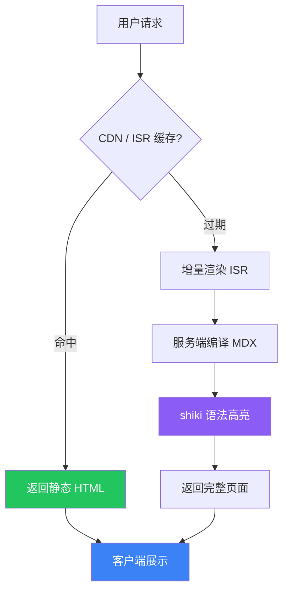
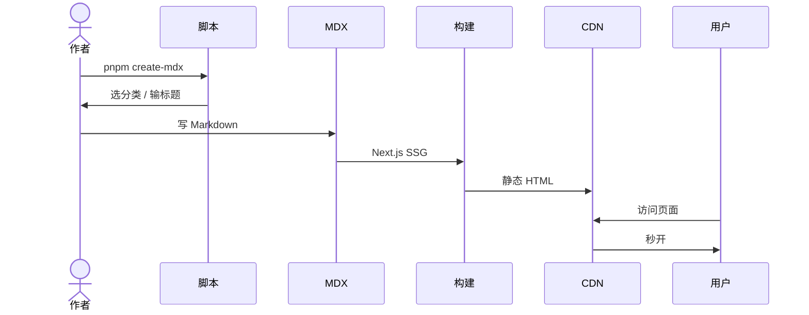

# 优化后的写作体验

以前写代码块要用 JSX 组件包模板字面量，现在直接用**标准 Markdown 围栏语法**，简洁到不行。

## 代码高亮（服务端 shiki，零客户端 JS）

### Bash

```bash
#!/bin/bash
# 启动所有 Docker 服务
docker compose -f docker-compose.prod.yml up -d \
  --scale worker=3 \
  --timeout 120

echo "部署完成！版本: $DEPLOY_VERSION"
```

### TypeScript

```typescript
interface ApiResponse<T> {
  code: number;
  data: T;
  message: string;
}

async function fetchUser(id: string): Promise<ApiResponse<User>> {
  const res = await fetch(`/api/users/${id}`, {
    headers: { Authorization: `Bearer ${getToken()}` },
  });
  return res.json();
}
```

### Go

```go
package main

import (
    "fmt"
    "net/http"
)

func handler(w http.ResponseWriter, r *http.Request) {
    w.Header().Set("Content-Type", "application/json")
    fmt.Fprintf(w, `{"status": "ok", "path": "%s"}`, r.URL.Path)
}

func main() {
    http.HandleFunc("/", handler)
    http.ListenAndServe(":8080", nil)
}
```

### JSON

```json
{
  "name": "blog-optimization",
  "version": "2.0.0",
  "scripts": {
    "build": "next build",
    "highlight": "shiki + rehype-pretty-code"
  },
  "performance": {
    "codeHighlight": "server-side",
    "clientJS": "0kb for code blocks"
  }
}
```

### Python

```python
from dataclasses import dataclass

@dataclass
class Article:
    title: str
    slug: str
    content: str
    author: str = "Gemini"
    published: bool = False

    def publish(self) -> None:
        self.published = True
        print(f"✓ 文章「{self.title}」已发布")
```

### SQL

```sql
-- 用户权限查询
SELECT
    u.id,
    u.username,
    r.name AS role_name,
    COUNT(p.id) AS permission_count
FROM sys_user u
JOIN sys_user_role ur ON u.id = ur.user_id
JOIN sys_role r ON ur.role_id = r.id
JOIN sys_role_permission rp ON r.id = rp.role_id
JOIN sys_permission p ON rp.permission_id = p.id
WHERE u.status = 1
GROUP BY u.id, u.username, r.name
ORDER BY u.id;
```

## Mermaid 图表

图表自动检测 mermaid 语言标记，按需懒加载（无图表的页面不加载 Mermaid 库）：





## 提示框

<Tip type="info">
**信息：** 优化后代码高亮在服务端完成，客户端不再加载 react-syntax-highlighter（约 500KB）。
</Tip>

<Tip type="success">
**成功：** 所有页面通过 generateStaticParams 预渲染为静态 HTML，首屏加载大幅提升。
</Tip>

<Tip type="warning">
**注意：** Mermaid 图表仍需客户端渲染，但已改为懒加载——没有图表的页面不会加载 mermaid 库。
</Tip>

<Tip type="error">
**提醒：** 不要在 fenced code block 内部写 Markdown 语法，代码块内的内容会原样输出。
</Tip>

## 卡片组件

<Card>
  <CardHeader>
    <CardTitle>性能优化成果</CardTitle>
    <CardDescription>优化前后对比</CardDescription>
  </CardHeader>
  <CardContent>

| 指标 | 优化前 | 优化后 |
|------|--------|--------|
| 代码高亮 | 客户端约 500KB | 服务端 0KB |
| Mermaid | 全量加载约 1MB | 按需懒加载 |
| 页面渲染 | 动态 SSR | 静态 SSG + ISR |
| 代码块写法 | JSX 组件 + 模板字面量 | Markdown 围栏语法 |

  </CardContent>
</Card>

## 图片（点击放大）

<Image
  src="/avatar.jpeg"
  alt="头像示例"
  width={400}
  height={400}
/>

## LaTeX 数学公式

行内公式：$E = mc^2$，$\alpha + \beta = \gamma$

块级公式：

$$
\int_{-\infty}^{\infty} e^{-x^2} dx = \sqrt{\pi}
$$

$$
\begin{bmatrix}
a & b \\
c & d
\end{bmatrix}
\begin{bmatrix}
x \\
y
\end{bmatrix}
=
\begin{bmatrix}
ax + by \\
cx + dy
\end{bmatrix}
$$

$$
f(x) = \sum_{n=0}^{\infty} \frac{f^{(n)}(a)}{n!}(x-a)^n
$$

## 表格

| 组件 | 用途 | 客户端? |
|------|------|---------|
| 代码围栏块 | 代码高亮 | 否（服务端 shiki） |
| Tip 组件 | 提示框 | 否（服务端） |
| Mermaid 图表 | 流程图/时序图 | 是（懒加载） |
| Image 组件 | 图片预览 | 是（Dialog 交互） |
| Card 组件 | 卡片布局 | 否（服务端） |
| Badge 组件 | 标签徽章 | 否（服务端） |

## 标签

<Badge>默认</Badge> <Badge variant="secondary">次要</Badge> <Badge variant="outline">轮廓</Badge>

## 总结

优化后写文章只需要知道这五件事：

1. **代码块** — 用三个反引号加语言名开头，三个反引号结尾，中间直接写代码
2. **图表** — 三个反引号加 mermaid，中间写 Mermaid 语法
3. **公式** — 用 `$...$` 写行内公式，`$$...$$` 写块级公式
4. **提示框** — 用 Tip 组件，type 可选 info / success / warning / error
5. **图片** — 用 Image 组件，src / alt / width / height 属性

简单直接，不再憋屈。

<AuthorBio name="Gemini" date="2026-05-28" />
