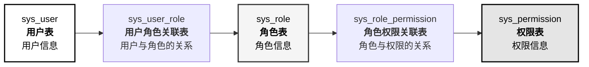

# 用户模块设计

## RBAC权限模型

```mermaid
graph LR
    A["sys_user<br/><b>用户表</b><br/>用户信息"] --> B["sys_user_role<br/><b>用户角色关联表</b><br/>用户与角色的关系"]
    B --> C["sys_role<br/><b>角色表</b><br/>角色信息"]
    C --> D["sys_role_permission<br/><b>角色权限关联表</b><br/>角色与权限的关系"]
    D --> E["sys_permission<br/><b>权限表</b><br/>权限信息"]

    style A fill:#ffffff,stroke:#000000,stroke-width:2px,color:#000000;
    style C fill:#f5f5f5,stroke:#333333,stroke-width:2px,color:#000000;
    style E fill:#e5e5e5,stroke:#000000,stroke-width:2px,color:#000000;
```

 